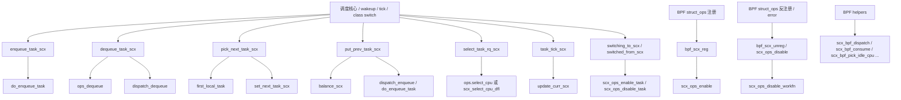
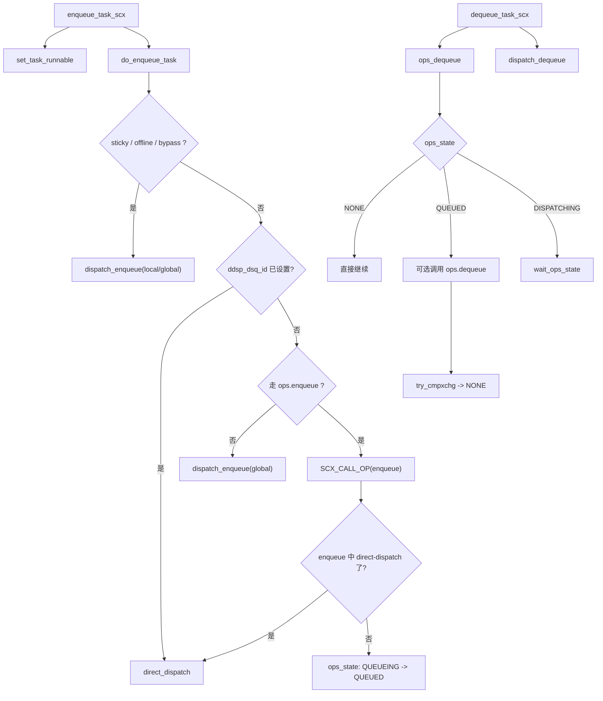
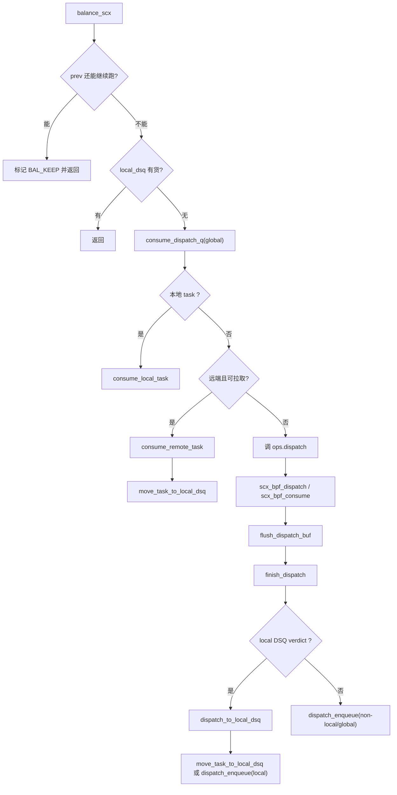
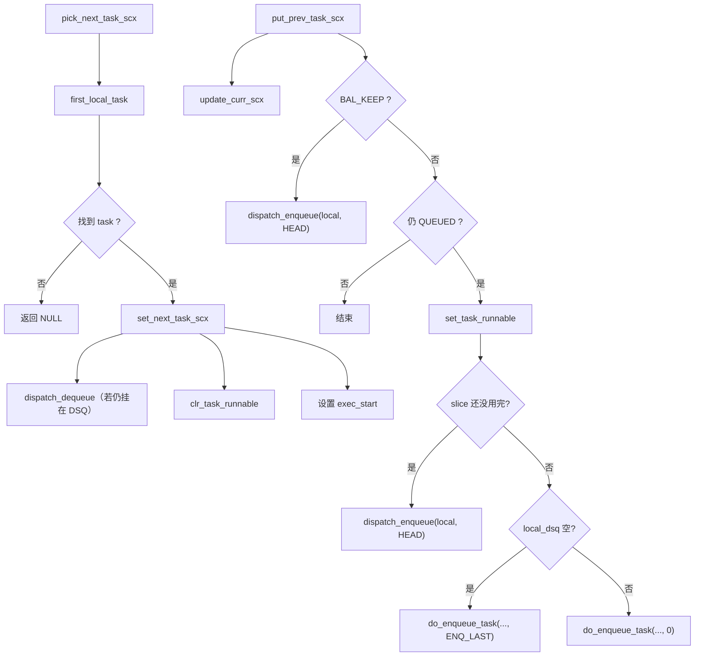
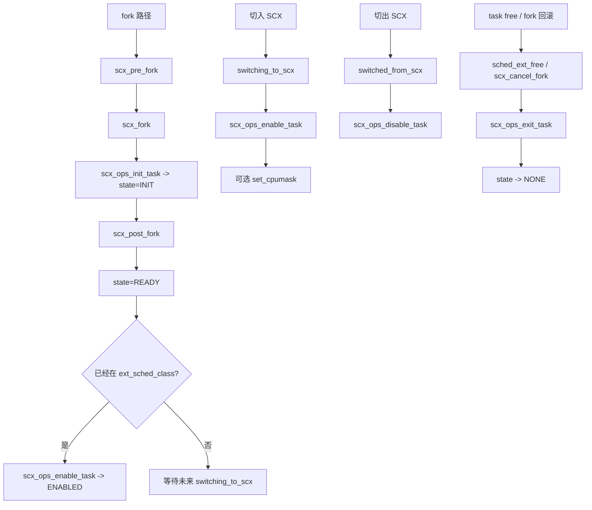
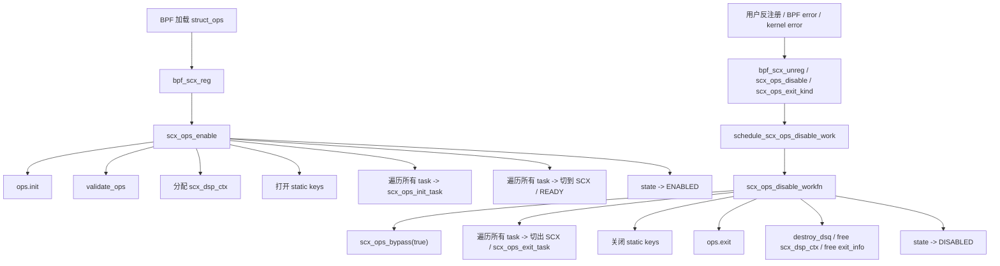

# sched_ext 完整技术文档

> **版本信息**：基于 Linux mainline 内核（commit: 2c390dda9e03）
> **最后更新**：2026-03-27
> **文档性质**：整合自三份 sched_ext 技术文档，覆盖入门教程、源码导读、接口语义详解

---

## 目录

- [第一部分：概述与架构](#第一部分概述与架构)
  - [1.1 一句话、三件事、三层结构](#11-一句话三件事三层结构)
  - [1.2 三条不变量](#12-三条不变量)
  - [1.3 三层架构详解](#13-三层架构详解)
  - [1.4 策略世界 vs 执行世界](#14-策略世界-vs-执行世界)
- [第二部分：快速开始](#第二部分快速开始)
  - [2.1 配置依赖清单](#21-配置依赖清单)
  - [2.2 sched_ext selftest 验证](#22-sched_ext-selftest-验证)
  - [2.3 sched_ext sample（用户态策略）](#23-sched_ext-sample用户态策略)
  - [2.4 基础运维与观测](#24-基础运维与观测)
- [第三部分：核心概念与数据结构](#第三部分核心概念与数据结构)
  - [3.1 DSQ 队列模型](#31-dsq-队列模型)
  - [3.2 sched_ext_entity 核心字段](#32-sched_extentity-核心字段)
  - [3.3 scx_enabled() 与启用机制](#33-scx_enabled-与启用机制)
- [第四部分：生命周期与时序](#第四部分生命周期与时序)
  - [4.1 Task 生命周期状态机](#41-task-生命周期状态机)
  - [4.2 从唤醒到运行的主时序](#42-从唤醒到运行的主时序)
  - [4.3 四条关键调用链](#43-四条关键调用链)
  - [4.4 CPU 补货流程 balance_one](#44-cpu-补货流程-balance_one)
  - [4.5 关键机制：Bypass / Buffer-Flush / Deferred](#45-关键机制bypass--buffer-flush--deferred)
- [第五部分：BPF 侧接口详解](#第五部分bpf-侧接口详解)
  - [5.1 DEFINE_SCHED_CLASS(ext) 总表](#51-define_sched_classext-总表)
  - [5.2 sched_ext_ops 钩子分组详解](#52-sched_ext_ops-钩子分组详解)
  - [5.3 钩子类型判断：通知型 vs 决策型](#53-钩子类型判断通知型-vs-决策型)
  - [5.4 非钩子但同样重要的 sched_ext_ops 字段](#54-非钩子但同样重要的-sched_ext_ops-字段)
  - [5.5 常见误解与注意事项](#55-常见误解与注意事项)
- [第六部分：内核侧实现详解](#第六部分内核侧实现详解)
  - [6.1 阅读建议与模块地图](#61-阅读建议与模块地图)
  - [6.2 基础机制模块](#62-基础机制模块)
  - [6.3 全局状态控制](#63-全局状态控制)
  - [6.4 DSQ 操作模块](#64-dsq-操作模块)
  - [6.5 任务调度核心路径](#65-任务调度核心路径)
  - [6.6 CPU 选择与 idle tracking](#66-cpu-选择与-idle-tracking)
  - [6.7 时间与 tick](#67-时间与-tick)
  - [6.8 fork/free/类切换](#68-forkfree类切换)
  - [6.9 BPF struct_ops 注册](#69-bpf-struct_ops-注册)
  - [6.10 BPF helper 实现](#610-bpf-helper-实现)
  - [6.11 关键调用逻辑图](#611-关键调用逻辑图)
- [第七部分：API 参考](#第七部分api-参考)
  - [7.1 常用钩子函数 ops 速查](#71-常用钩子函数-ops-速查)
  - [7.2 BPF kfunc/Helper 分类参考](#72-bpf-kfunchelper-分类参考)
  - [7.3 ops.flags 速查表](#73-opsflags-速查表)
  - [7.4 stub 函数组](#74-stub-函数组)
- [第八部分：实践示例](#第八部分实践示例)
  - [8.1 最简 FIFO 调度器](#81-最简-fifo-调度器)
  - [8.2 基于权重的 vtime 调度](#82-基于权重的-vtime-调度)
  - [8.3 自定义 DSQ 实现优先级队列](#83-自定义-dsq-实现优先级队列)
  - [8.4 直接投递优化示例](#84-直接投递优化示例)
  - [8.5 完整可运行示例（scx_simple）](#85-完整可运行示例scx_simple)
- [第九部分：调试与进阶](#第九部分调试与进阶)
  - [9.1 常见问题与调试](#91-常见问题与调试)
  - [9.2 源码阅读路径地图](#92-源码阅读路径地图)
  - [9.3 性能基准测试](#93-性能基准测试)
- [附录](#附录)
  - [附录A：术语表](#附录a术语表)
  - [附录B：不变量](#附录b不变量)
  - [附录C：边界条件与踩坑](#附录c边界条件与踩坑)
  - [附录D：调度框架基础](#附录d调度框架基础)
  - [附录E：与其他调度器对比](#附录e与其他调度器对比)
  - [附录F：版本兼容性说明](#附录f版本兼容性说明)
- [参考资料](#参考资料)

---

## 第一部分：概述与架构

### 1.1 一句话、三件事、三层结构

**一句话**：sched_ext 让 eBPF 程序决定"任务该排到哪里、谁先跑"，内核负责"真正从队列取任务跑、保证一致性与可回退"。

- **一致性**：BPF 只能通过受控 API 改变队列/状态，内核负责把这些改动以安全方式落地。
- **可回退**：如果 BPF scheduler 出错、卡死、或触发特定条件，内核会退出/禁用 sched_ext，把系统交还给默认调度（CFS 等），避免整机不可用。

**三件事（理解 sched_ext 最关键的三块）：**

1. **策略接口（ops）**：BPF 提供一组策略接口（ops）回调，覆盖唤醒、入队、dispatch、运行期等关键事件；每当任务或 CPU 进入关键状态，内核就会通知 BPF。
2. **队列模型（DSQ）**：BPF 不直接返回 next task，而是把任务放进 DSQ；CPU 最终从 **local DSQ** 取任务执行。
3. **内核执行骨架**：当 CPU 缺活时按固定顺序：**local → global → dispatch（BPF 补货）**，并用 buffer/flush/deferred 来保证安全与性能。
   - **buffer/flush**：BPF 在回调里做的插入经常先写入"待提交缓冲"，在安全点统一落地，避免在不合适的上下文直接改队列。
   - **跨 CPU 延迟（deferred）**：当策略想把任务投递到"别的 CPU 的 local"时，内核必须在安全点完成远端 rq 操作，因此会出现 deferred 机制。

**三层结构（总览）：**

- 上层：ops（事件驱动）
- 中层：DSQ（策略输出的载体）
- 下层：内核骨架（取任务的固定流水线）

---

### 1.2 三条不变量

1. **CPU 只从 local DSQ 取任务运行**

   其他任何地方（global DSQ、自定义 DSQ、BPF map 私有队列）都只是"候选集合"。要真正运行，必须最终主动或被动进入某 CPU 的 local DSQ。

2. **dispatch 是 CPU 侧"缺活"回调，不是每次调度都调用**

   dispatch 的触发条件是：当前 CPU 的 local DSQ 为空（且通常 global 也空或消费失败），才会进入补货循环调用 ops.dispatch()。因此，写 eBPF 策略时，需注意并不仅仅是把任务放入 local 才会执行，放入 global 可能也会被动的执行。

3. **BPF 的入队请求经常不是"立即生效"，而是 buffer/flush/deferred 后落地**

   这决定了很多行为：比如 vtime 的内置 DSQ 限制是 flush 时检测；跨 CPU 插入会进入 deferred。

---

### 1.3 三层架构详解

```text
                 +--------------------------------------+
                 |      kernel/sched/core.c             |
                 |  通用调度入口 / 唤醒 / pick / tick     |
                 +-------------------+------------------+
                                     |
                                     | 调用 sched_class.ext
                                     v
                 +--------------------------------------+
                 |        kernel/sched/ext.c            |
                 |  SCX core / bridge / 状态机 / DSQ     |
                 |  - 维护 task->scx / rq->scx 状态      |
                 |  - 管理 local/global/user DSQ         |
                 |  - 决定何时调用 ops.*                 |
                 +-------------------+------------------+
                                     |
                                     | SCX_CALL_OP(...)
                                     v
                 +--------------------------------------+
                 |       struct sched_ext_ops           |
                 |    BPF scheduler policy callbacks    |
                 |  - select_cpu / enqueue / dispatch   |
                 |  - runnable / running / stopping     |
                 |  - lifecycle / dump / hotplug        |
                 +--------------------------------------+
```

理解这三层时，最重要的一点是：

- `sched_class ext` 决定"调度核心什么时候进入 SCX"
- `ext.c` 决定"内核和 BPF 谁在什么时刻拥有这个 task / CPU / DSQ"
- `sched_ext_ops` 决定"策略怎么选、怎么排、怎么记账"

一句话类比：

- `core.c` 像"总调度台"
- `ext.c` 像"翻译层 + 总线 + 交通警察"
- `sched_ext_ops` 像"BPF 调度器真正写策略的地方"
- DSQ 像"候车区 / 中转站"

---

### 1.4 策略世界 vs 执行世界

* **策略世界（BPF）**：做"决策与排队动作"
  * 插入 DSQ、设置 slice/vtime、选择 CPU、统计/记账
  * 通过受控的 kfunc/helper 表达策略意图

* **执行世界（内核）**：做"时机、落地、兜底"

  * 决定何时调用 ops 回调
  * 如何把 BPF 的排队请求在正确的上下文、正确的锁与一致性规则下落地（buffer/flush/deferred）
  * 最终从 local DSQ 取任务运行
  * 出错时进入 bypass 或退出 SCX，回退到默认调度

---

## 第二部分：快速开始

### 2.1 配置依赖清单

```sh
#!/bin/bash

# 检查.config文件是否存在
if [ ! -f ".config" ]; then
    echo "错误: 找不到 .config 文件"
    exit 1
fi

# 定义需要检查的配置项数组
configs=(
    # sched_ext 强制依赖项
    "CONFIG_BPF"
    "CONFIG_BPF_SYSCALL"
    "CONFIG_BPF_JIT"
    "CONFIG_DEBUG_INFO"
    "CONFIG_DEBUG_INFO_BTF"
    "CONFIG_BPF_JIT_ALWAYS_ON"
    "CONFIG_BPF_JIT_DEFAULT_ON"
    "CONFIG_PAHOLE_HAS_SPLIT_BTF"
    "CONFIG_PAHOLE_HAS_BTF_TAG" # x86 和 arm 上默认不开启，不需要主动开启
    "CONFIG_SCHED_CLASS_EXT"    # x86 和 arm 上默认不开启，需要主动开启

    "CONFIG_SCHED_DEBUG"        # grep ext /proc/self/sched 时需要

    # sched_ext 依赖项，当 CONFIG_SCHED_CLASS_EXT 开启时，会默认开启
    "CONFIG_EXT_GROUP_SCHED"
    "CONFIG_GROUP_SCHED_WEIGHT"
    "CONFIG_FAIR_GROUP_SCHED"

    # BPF selftest 需要
    "CONFIG_FPROBE"             # x86 和 arm 上默认不开启，x86 上应开尽开，arm 上可能无法开启
    "CONFIG_TEST_BPF"           # x86 和 arm 上默认不开启，需要主动开启
    "CONFIG_DEBUG_INFO_BTF_MODULES"

    # 参考外部合入补丁发现可能涉及的配置：通常不阻塞，无需过度关注
    "CONFIG_CGROUP_BPF"
    "CONFIG_BPF_LSM"
    "CONFIG_SCHED_CORE"         # x86 和 arm 上默认不开启，不需要主动开启
    "CONFIG_SMP"
    "CONFIG_CGROUPS"
    "CONFIG_SCHED_SMT"
    "CONFIG_CGROUP_SCHED"
    "CONFIG_NO_HZ_COMMON"
    "CONFIG_UCLAMP_TASK"        # x86 和 arm 上默认不开启，不需要主动开启
    "CONFIG_STACKTRACE"
    "CONFIG_IDLE_INJECT"        # arm 上默认不开启，不需要主动开启
    "CONFIG_CFS_BANDWIDTH"
    "CONFIG_SCHED_MC"
)

# 遍历并检查每个配置项
for config in "${configs[@]}"; do
    # 查找非注释行，且配置项为=y或=m
    if grep -q -E "^$config=(y|m)" .config; then
        status="已启用"
    else
        status="***未启用***"
    fi
    printf "%-30s %s\n" "$config" "$status"
done
```

> **注意（version-sensitive）**：上述配置项的具体默认值取决于内核版本、架构与发行版。建议使用 `make menuconfig` 交互式配置，并以实际构建结果为准。

---

### 2.2 sched_ext selftest 验证

```sh
# 需要提前替换内核，或使用 qemu。如果不替换内核或不使用qemu，那后续编译完，在执行的时候，用的仍然是旧内核

# ====================
# 编译 sched_ext selftest
# ====================
cd kernel_path # cd 到内核源码的路径
make -C tools/testing/selftests/sched_ext clean -s && \
make headers_install -s && \
make -C tools/testing/selftests/sched_ext -j$(nproc) -s

# ====================
# 运行 sched_ext selftest
# ====================
# 需要 root 权限运行
./tools/testing/selftests/sched_ext/runner

# 预期结果：全部通过，显示 "PASS" 或类似成功信息
```

---

### 2.3 sched_ext sample（用户态策略）

```sh
# 需要提前替换内核，或使用 qemu。如果不替换内核或不使用qemu，那后续编译完，在执行的时候，用的仍然是旧内核

# ====================
# 编译 sched_ext sample
# ====================
cd kernel_path # cd 到内核源码的路径
make -C tools/sched_ext clean -s && \
make headers_install -s && \
make -C tools/sched_ext -j$(nproc) -s

# ====================
# 运行 sched_ext sample
# ====================
# ll ./tools/sched_ext/build/bin/
total 4088
-rwxr-xr-x. 1 root root 1032120 Aug 10 06:18 scx_central
-rwxr-xr-x. 1 root root 1068048 Aug 10 06:18 scx_flatcg # 需要依赖 cgroup v2
-rwxr-xr-x. 1 root root 1064352 Aug 10 06:18 scx_qmap
-rwxr-xr-x. 1 root root 1017968 Aug 10 06:18 scx_simple

# 默认存在多个 sample，可直接运行
./tools/sched_ext/build/bin/scx_central
./tools/sched_ext/build/bin/scx_flatcg
./tools/sched_ext/build/bin/scx_qmap
./tools/sched_ext/build/bin/scx_simple
```

---

### 2.4 基础运维与观测

```sh
# ====================
# 基础运维命令 sched_ext sample
# ====================
grep ext /proc/self/sched && \
cat /sys/kernel/sched_ext/state && \
cat /sys/kernel/sched_ext/root/ops && \
./tools/sched_ext/scx_show_state.py
```

* 查看 sched_ext 是否启用：

```sh
cat /sys/kernel/sched_ext/state
# enabled
```

* 查看当前使用的 BPF 调度器名称：

```sh
cat /sys/kernel/sched_ext/root/ops
# simple
```

* 判断系统自启动以来是否加载过 BPF 调度器：

```sh
cat /sys/kernel/sched_ext/enable_seq
# 1
```

* 使用 drgn 脚本查看更详细状态：

```sh
chmod +x ./tools/sched_ext/scx_show_state.py
./tools/sched_ext/scx_show_state.py
```

输出示例（字段与枚举值可能随版本变化）：

```txt
ops           : simple
enabled       : 1
switching_all : 1
switched_all  : 1
enable_state  : enabled (2)
bypass_depth  : 0
nr_rejected   : 0
enable_seq    : 1
```

* 判断某个任务是否由 sched_ext 调度（需要 CONFIG_SCHED_DEBUG）：

```sh
grep ext /proc/self/sched
# ext.enabled : 1
```

---

## 第三部分：核心概念与数据结构

### 3.1 DSQ 队列模型

> **本节目的**：把"策略输出"统一理解为"往 DSQ 里放/搬任务"，并介绍 DSQ 的内部结构与 ID 语义。

#### 3.1.1 DSQ 角色划分

DSQ（Dispatch Queue）是 sched_ext 中"任务排队/搬运"的核心容器。按角色分：

* **local DSQ（per-CPU）**
  * CPU 取任务跑的唯一入口（最终执行队列）
  * 当 SCX 调度类需要选择 next task 时，典型实现会优先消费当前 CPU 的 local DSQ（内部以 list 表达 dispatch 顺序）
  * 例：ext.c 中的某些路径会从 `rq->scx.local_dsq.*` 消费任务

* **global DSQ（系统内置）**

  * 默认全局 FIFO 池
  * 作为系统级共享候选队列与兜底通路：当某 CPU local DSQ 为空时，内核会尝试从 global DSQ 消费并转入 local DSQ，避免空转并提供简单供货路径

* **自定义 DSQ（策略创建）**

  * 策略实现的主战场（分层、分桶、NUMA、配额、优先级等）
  * 自定义 DSQ 中的任务不会被 CPU 直接执行，通常需要在 `ops.dispatch()` 中通过 move/insert 把任务投递到目标 CPU 的 local DSQ 或 global DSQ 才可能运行

* **CPU 缺活时的固定框架流程（内核执行侧）**
  * 典型逻辑：local → global → 调用 dispatch → flush → 再检查（循环）
  * 结论：dispatch 不是"每次调度都调用"，而是"CPU 缺活时才调用"

**DSQ 角色类比**：

DSQ 不是"最终调度算法本身"，而是 SCX core 给 BPF scheduler 提供的交接缓冲层。

```text
 BPF scheduler 的策略队列
        |
        | dispatch / consume
        v
   +-----------+        +------------------+
   | global DSQ | ----> | local DSQ (per CPU) |
   +-----------+        +------------------+
                               |
                               v
                           CPU 真正执行
```

可把它理解成：

- BPF 侧决定"谁该上车"
- SCX core 负责把人送到"对应站台"
- CPU 只会从自己的 `local DSQ` 直接取任务执行

#### 3.1.2 DSQ 数据结构

```c
struct scx_dispatch_q {
    raw_spinlock_t lock;                      /* 自旋锁，保护队列操作 */
    struct task_struct __rcu *first_task;     /* 队首任务（RCU 无锁读取） */
    struct list_head list;                    /* 双向链表，按 dispatch order 排列 */
    struct rb_root priq;                      /* 红黑树，vtime 模式下定位插入位置 */
    u32 nr;                                   /* 队列任务数 */
    u32 seq;                                  /* BPF 迭代器序列号 */
    u64 id;                                   /* 队列唯一标识 */
    struct rhash_head hash_node;              /* 哈希表节点 */
    struct llist_node free_node;              /* 回收节点，内存池复用 */
    struct rcu_head rcu;                      /* RCU 延迟释放 */
};
```

**核心设计：双模式队列**

DSQ 支持两种模式，共用同一套数据结构：

| 模式      | 使用字段        | 说明                                    |
| --------- | --------------- | --------------------------------------- |
| **FIFO**  | `list`          | 先来先服务                              |
| **VTIME** | `list` + `priq` | `priq` 定位插入点，落到 `list` 正确位置 |

**队首无锁读取**

`first_task` 配合 RCU 允许不持锁"偷看"队首，减少锁竞争。

**全局 DSQ 哈希表**

每个 DSQ 通过 `hash_node` 加入内核的**全局 DSQ 哈希表**。调度器通过 `dsq_id` 在哈希表中快速找到对应的 DSQ 结构（O(1) 复杂度）：

```
全局 DSQ 哈希表（key = id）
├── id=0      →  SCX_DSQ_GLOBAL（内置全局 FIFO，fallback 用）
├── id=100    →  自定义 DSQ（scx_bpf_create_dsq(100, flags) 创建）
├── id=200    →  自定义 DSQ
└── ...
```

- **为什么需要哈希表？**
  BPF 调度器调用 `scx_dispatch_to_dsq(task, dsq_id)` 时，内核只知道 dsq_id（一个整数），需要快速找到对应的 `struct scx_dispatch_q` 对象。哈希表提供 O(1) 查找。
- **`hash_node` 的作用**：
  每个 `scx_dispatch_q` 实例是哈希表的一个 entry，`hash_node` 是这个 entry 的链表节点（拉链法解决哈希冲突）。
- **本地 DSQ 不走哈希表**：
  本地 DSQ 是 per-CPU 的，通常用数组或 per-CPU 变量直接管理，不需要通过 id 查找，所以不加入哈希表。

**内存池复用**

`free_node` 把空闲 DSQ 放入链表池，新 DSQ 从这里复用，避免频繁 `kmalloc`/`kfree`。

**DSQ 类型总结**

| 类型           | 创建方式                            | 管理方式                    | 用途                   |
| -------------- | ----------------------------------- | --------------------------- | ---------------------- |
| **本地 DSQ**   | 内置（per-CPU）                     | 数组/per-CPU 变量，直接寻址 | 缓冲本地任务到调度核心 |
| **全局 DSQ**   | 内置（ID=0）                        | 哈希表，key=0               | fallback，跨 CPU 调度  |
| **自定义 DSQ** | `scx_bpf_create_dsq(dsq_id, flags)` | 哈希表，key=用户指定        | BPF 调度策略自定义     |

**本质上都是 `struct scx_dispatch_q`**，区别在于：

- 本地 DSQ 用数组直接管理
- 全局/自定义 DSQ 通过 `dsq_id` 在哈希表中查找

#### 3.1.3 insert 与 insert_vtime 混用语义（gotcha）

* `scx_bpf_dsq_insert()`（FIFO）：
  * 直接按队首/队尾（或 PREEMPT 插头）修改 list
  * 不参考 rb-tree

* `scx_bpf_dsq_insert_vtime()`：

  * 先入 rb-tree（按 vtime 定位）
  * 再插入 list 的"正确位置"，使 vtime 插入的任务之间保持有序

**因此混用后的序列会变成：**

> **"vtime 任务局部有序 + FIFO 任务按头/尾规则穿插"**
> 从而不再保证"全局严格按 vtime"。

**判断准则（不减少细节的前提下给出可操作建议）：**

* 如果策略语义是"严格按 vtime 排序"，**避免混用**；否则会引入难以直觉推导的穿插顺序。
* 如果策略语义是"主序由 vtime 决定，但允许某些任务用 FIFO 快速通道插队（例如 kthread、短任务、交互任务）"，混用是成立的，但要把这种"快通道"写进文档或注释加以明确，避免歧义。

#### 3.1.4 DSQ ID 格式详解

```c
/*
 * DSQ (dispatch queue) IDs are 64bit of the format:
 *
 *   Bits: [63] [62 ..  0]
 *         [ B] [   ID   ]
 *
 *    B: 1 for IDs for built-in DSQs, 0 for ops-created user DSQs
 *   ID: 63 bit ID
 *
 * Built-in IDs:
 *
 *   Bits: [63] [62] [61..32] [31 ..  0]
 *         [ 1] [ L] [   R  ] [    V   ]
 *
 *    1: 1 for built-in DSQs.
 *    L: 1 for LOCAL_ON DSQ IDs, 0 for others
 *    V: For LOCAL_ON DSQ IDs, a CPU number. For others, a pre-defined value.
 */
enum scx_dsq_id_flags {
    SCX_DSQ_FLAG_BUILTIN        = 1LLU << 63,
    SCX_DSQ_FLAG_LOCAL_ON       = 1LLU << 62,

    SCX_DSQ_INVALID             = SCX_DSQ_FLAG_BUILTIN | 0,
    SCX_DSQ_GLOBAL              = SCX_DSQ_FLAG_BUILTIN | 1,
    SCX_DSQ_LOCAL               = SCX_DSQ_FLAG_BUILTIN | 2,
    SCX_DSQ_BYPASS              = SCX_DSQ_FLAG_BUILTIN | 3,
    SCX_DSQ_LOCAL_ON            = SCX_DSQ_FLAG_BUILTIN | SCX_DSQ_FLAG_LOCAL_ON,
    SCX_DSQ_LOCAL_CPU_MASK      = 0xffffffffLLU,
};
```

使用示例：

```c
// 插入到 CPU 3 的 local DSQ
scx_bpf_dsq_insert(p, SCX_DSQ_LOCAL_ON | 3, slice, flags);

// SCX_DSQ_LOCAL 的含义：
// - 对于"当前正在调度/dispatch 的 CPU"，其 local DSQ 的快捷写法
// - 由内核自动解析为对应 CPU 的 local DSQ ID
scx_bpf_dsq_insert(p, SCX_DSQ_LOCAL, slice, flags);
```

---

### 3.2 sched_ext_entity 核心字段

`include/linux/sched/ext.h` 中的 `struct sched_ext_entity` 是每个 task 在 SCX 侧的附加状态，几个最关键的字段如下：

- `flags`
  - `SCX_TASK_QUEUED`：task 当前处于 SCX runqueue 语义里
  - `SCX_TASK_BAL_KEEP`：本轮 balance 决定让当前 task 尽量继续执行
  - `SCX_TASK_DEQD_FOR_SLEEP`：上一次 dequeue 是因为 sleep
- `ops_state`
  - 表示 task 当前是 `NONE / QUEUEING / QUEUED / DISPATCHING`
  - 这是内核与 BPF 调度器之间的"所有权握手位"
- `slice`
  - 当前执行预算，`update_curr_scx()` 会随着运行消耗它
  - 归零时触发重新调度
- `dsq` / `dsq_list` / `dsq_vtime`
  - task 当前在哪个 DSQ
  - 以及在优先队列 DSQ 中的排序位置
- `runnable_node` / `runnable_at`
  - task 处于 runnable 状态链表中的节点和时间戳
- `sticky_cpu` / `holding_cpu`
  - 用于 remote dispatch / CPU 迁移过程中的同步

---

### 3.3 scx_enabled() 与启用机制（static key）

> **本节目的**：介绍 `scx_enabled()` 作用，以及何时变为 true。

宏（示意）：

```c
#define scx_enabled() static_branch_unlikely(&__scx_enabled)
```

* `static_branch_unlikely()`：静态分支（Static Keys），告诉编译器该分支大概率为 false（默认未启用）
* 配合 `DECLARE_STATIC_KEY_FALSE(__scx_enabled)`：默认 false，启用时 patch 指令路径

启用/禁用（语义）：

```c
DECLARE_STATIC_KEY_FALSE(__scx_enabled);

// 启用（用户态触发 enable 流程后）
static_branch_enable(&__scx_enabled);

// 禁用
static_branch_disable(&__scx_enabled);
```

**何时变为 true（语义化描述，避免绑定某一种 control plane 形式）：**

1. 用户态加载并完成 BPF 调度器注册（BPF 程序、maps、struct_ops 等）
2. 通过内核提供的 control plane 接口触发启用（常见暴露为 sysfs 节点，如 `/sys/kernel/sched_ext/state`）
3. 内核在 `scx_enable()` 里执行 `static_branch_enable(&__scx_enabled)`，从此 `scx_enabled()` 返回 true，调度框架进入 SCX 路径

**相关宏：**

* `static_branch_likely()`：条件大概率 true
* `static_branch_unlikely()`：条件大概率 false
* `static_branch_inc()`：原子递增引用计数（支持嵌套启用）

---

## 第四部分：生命周期与时序

### 4.1 Task 生命周期状态机

> **本节目的**：从"任务状态机"角度介绍每个 ops 回调的语义位置，了解哪些回调是 task 侧、哪些是 CPU 侧。

#### 4.1.1 high-level 时间线（主因果）

一个任务在 sched_ext 下大体经历：

1. **进入 SCX**：`init_task → enable`
2. **变 runnable**：wakeup/创建后进入可运行态（触发 CPU 选择与入队路径）
3. **被调度执行**：CPU 需要任务时，local/global/自定义 DSQ 形成供货链路，最终进入 local 被 pick 运行
4. **运行期循环**：`running → tick → stopping` 多轮循环（slice 用尽/被抢占/阻塞）
5. **进入 sleep 或退出 SCX**：`quiescent` 或 `disable`
6. **进程退出**：`exit_task`

#### 4.1.2 生命周期伪码（语义化）

> 这段伪码用于从"状态机/因果"的角度理解 sched_ext 中 task 与 ops 回调关系，**不是精确的内核调用顺序**。

```c
ops.init_task();      // task 级初始化：建立 per-task 状态（BPF map/task storage 等）
ops.enable();         // task 接管生效：从此由当前 SCX ops 调度

while (task in SCHED_EXT) {

    // 唤醒阶段：select_cpu 发生在选 rq 阶段（允许迁移时）
    if (task can migrate)
        ops.select_cpu();   // 仅返回 CPU，或 direct insert 到 LOCAL/LOCAL_ON

    ops.runnable();         // task 进入 runnable 集合（统计/记账）

    while (task is runnable) {

        // enqueue：决定 task 放入哪个候选集合（global/custom/local_on/策略私有池）
        if (task is not in a DSQ && task->scx.slice == 0) {
            ops.enqueue();
            // dispatch 是 CPU 缺活时触发，不是每个 task 必经
            ops.dispatch();
        }

        ops.running();      // task 开始运行

        while (task->scx.slice > 0 && task is runnable)
            ops.tick();     // tick：消耗 slice 或动态策略调整

        ops.stopping();     // task 停止占用 CPU（仍 runnable 或即将阻塞）
        ops.dispatch();     // 当前 CPU 再次缺活时补货（按需触发）
    }

    ops.quiescent();        // runnable -> non-runnable（sleep / wait）
}

ops.disable();              // task 解除 SCX 接管
ops.exit_task();            // task 退出：清理 per-task 状态
```

关键说明：

* local DSQ 是最终执行入口；其他容器必须通过 dispatch/move/insert 最终投递到 local 才能运行
* dispatch 的触发是 per-CPU 的缺活补货，而不是 per-task 的必经步骤
* select_cpu 与 enqueue 的"互斥/优化关系"：
  * select_cpu 如果 direct insert 到 local（常用于 idle CPU 快速投递），可能跳过 enqueue
  * 否则通常会走 enqueue 决定候选集合
* running/stopping 成对出现；running→stopping 之间可能有多次 tick

#### 4.1.3 SCX 任务状态枚举与流转

```c
// include/linux/sched/ext.h
enum scx_task_state {
    SCX_OPSS_NONE        = 0,
    SCX_OPSS_QUEUEING    = 1 << 0,
    SCX_OPSS_QUEUED      = 1 << 1,
    SCX_OPSS_DISPATCHING = 1 << 2,
};
```

状态流转（示意）：

```
SCX_OPSS_NONE
  → (切换/进入 SCX)
  → QUEUEING / QUEUED
  → (进入 DSQ) QUEUED
  → (dispatch 到 local) DISPATCHING
  → (pick 运行) running
  → (stopping) 回到 QUEUED 或 quiescent
  → (disable) NONE
```

回调与状态关系（语义对齐）：

* init_task：创建 per-task SCX 状态
* enable：任务开始由 SCX 调度（常见会初始化 slice / 初始排队）
* runnable：进入 runnable 集合
* enqueue：插入 DSQ，进入 QUEUED
* dispatch：从候选集合搬到 local，进入 DISPATCHING（语义）
* running：被选中运行，清除队列等待语义
* stopping：让出 CPU，可能重新入队
* quiescent：进入不可运行态，清理 queued 语义
* disable：离开 SCX
* exit_task：清理所有 per-task SCX 状态

#### 4.1.4 任务状态转换图

`runnable/running/stopping/quiescent` 四个钩子描述的是状态边界，不是同一个层面的事件。

```text
               runnable
     不可运行 -----------> 可运行但未必立刻上 CPU
                              |
                              | running
                              v
                           正在运行
                              |
                              | stopping
                              v
                      停止这次执行片段
                              |
                 +------------+-------------+
                 |                          |
                 | 仍可运行                  | 不再可运行
                 |                          |
                 v                          v
             runnable                   quiescent
```

类比成舞台状态：

- `runnable`：进候场区
- `running`：上台
- `stopping`：这次表演结束，先下台
- `quiescent`：离开候场区，不再待命

关键区别：

- `runnable/quiescent` 是"是否可运行"的边界
- `running/stopping` 是"一次执行片段"的边界

---

### 4.2 从唤醒到运行的主时序

```text
task wakeup
   |
   v
core.c: select_task_rq()
   |
   v
select_task_rq_scx()
   |
   +--> ops.select_cpu()         [可直接 scx_bpf_dispatch()]
   |         |
   |         +--> 如果直接 dispatch，则后续可跳过 ops.enqueue()
   |
   v
core.c: ttwu_do_activate() -> activate_task() -> enqueue_task()
   |
   v
enqueue_task_scx()
   |
   +--> ops.runnable()           [runnable 边界通知]
   +--> do_enqueue_task()
             |
             +--> ops.enqueue()  [如果没被 select_cpu 直接 dispatch]
             +--> 直接进 local/global/user DSQ
   |
   v
pick_next_task() 前
   |
   v
balance_scx()
   |
   +--> 先尝试 local DSQ / global DSQ
   +--> 不够就调用 ops.dispatch()
   |
   v
pick_next_task_scx()
   |
   v
set_next_task_scx()
   |
   +--> ops.running()            [running 边界通知]
   |
   v
CPU 开始运行 task
```

这里最容易误解的是：

- `select_cpu()` 不是最终 CPU 绑定，只是提前给一个"很可能对"的 hint
- `dispatch()` 不是"pick next task"的同义词，它是"本地 DSQ 空了，来补货"
- CPU 实际运行的是 `local DSQ` 里的 task，而不是直接运行 BPF 队列里的 task

---

### 4.3 四条关键调用链

#### 4.3.1 唤醒链：`ttwu -> select_cpu -> enqueue -> dispatch/pick`

```text
ttwu / wakeup
  -> core.c: select_task_rq()
  -> select_task_rq_scx()
       -> ops.select_cpu() or scx_select_cpu_dfl()
       -> 可直接 scx_bpf_dispatch()
  -> core.c: ttwu_do_activate()
  -> enqueue_task_scx()
       -> ops.runnable()
       -> do_enqueue_task()
            -> ops.enqueue() or 直接入 DSQ
  -> balance_scx()
       -> 必要时 ops.dispatch()
  -> pick_next_task_scx()
  -> set_next_task_scx()
       -> ops.running()
```

要点：

- `select_cpu()` 是 wakeup 路径上最早看到 task 的钩子
- `enqueue()` 是"入 BPF scheduler / 直接 dispatch"的决策点
- 真正 CPU 上执行之前，还要经过 `balance_scx()` 和 `pick_next_task_scx()`

#### 4.3.2 执行片段结束链：`tick/update_curr -> put_prev -> reenqueue`

```text
task 正在运行
  -> task_tick_scx()
       -> update_curr_scx()
       -> ops.tick()
       -> slice == 0 ? resched_curr()
  -> put_prev_task_scx()
       -> ops.stopping(true)
       -> 继续放 local DSQ 头 / 重新 do_enqueue_task()
```

要点：

- `tick()` 可以只是通知，也可以把 `slice` 置零主动促发调度
- `stopping(true)` 表示 task 这次执行结束了，但通常仍 runnable

#### 4.3.3 睡眠/出队链：`dequeue -> stopping(false) -> quiescent`

```text
task 准备睡眠 / 暂时摘队
  -> dequeue_task_scx()
       -> ops.dequeue()
       -> 如果当前正在跑：ops.stopping(false)
       -> ops.quiescent()
```

要点：

- `dequeue()` 处理的是"从 BPF scheduler / DSQ 语义中移除"
- `quiescent()` 处理的是"变成不可运行"
- 两者相关，但不是严格一一对应

#### 4.3.4 CPU 被抢走又归还：`switch_class -> cpu_release -> balance -> cpu_acquire`

```text
SCX 正在控制某 CPU
   |
   | 更高优先级 class 抢占 (stop/dl/rt)
   v
switch_class_scx()
   -> ops.cpu_release()
   -> rq->scx.cpu_released = true
   |
   | 之后 SCX 再次在该 CPU 上进入 balance
   v
balance_scx() / balance_one()
   -> 发现 cpu_released == true
   -> ops.cpu_acquire()
   -> cpu_released = false
```

这个钩子对"CPU 控制权"建模，而不是单纯对 task 建模。

---

### 4.4 CPU 补货流程 balance_one

> **本节目的**：把"local→global→dispatch→flush→再检查"的固定流水线与循环条件对齐到代码结构。

#### 4.4.1 补货循环的完整框架

> 完整流程（基于 kernel/sched/ext.c:2158 `balance_one`）：

```c
static int balance_one(struct rq *rq, struct task_struct *prev)
{
    bool prev_on_scx = prev->sched_class == &ext_sched_class;
    bool prev_on_rq = prev->scx.flags & SCX_TASK_QUEUED;
    int nr_loops = SCX_DSP_MAX_LOOPS;  // 32

    // ===== 阶段0: 前置检查 =====

    // 0.1) 如果启用了 CPU_PREEMPT，处理 CPU release/acquire
    if ((sch->ops.flags & SCX_OPS_HAS_CPU_PREEMPT) && unlikely(rq->scx.cpu_released)) {
        if (SCX_HAS_OP(sch, cpu_acquire))
            SCX_CALL_OP(sch, SCX_KF_REST, cpu_acquire, rq, cpu_of(rq), NULL);
        rq->scx.cpu_released = false;
    }

    // 0.2) 如果 prev 仍在 SCX 上运行
    if (prev_on_scx) {
        update_curr_scx(rq);  // 更新 prev 的运行时间统计

        // 如果 prev 仍 runnable 且还有 slice，直接 keep 它继续运行
        // （除非当前正在 bypass）
        if (prev_on_rq && prev->scx.slice && !scx_rq_bypassing(rq)) {
            rq->scx.flags |= SCX_RQ_BAL_KEEP;
            goto has_tasks;  // 结束，无需补货
        }
    }

    // ===== 阶段1: 快速路径检查 =====

    // 1.1) 检查 local DSQ 是否有任务
    if (rq->scx.local_dsq.nr)
        goto has_tasks;

    // 1.2) 尝试从 global DSQ 消费并转入 local
    if (consume_global_dsq(sch, rq))
        goto has_tasks;

    // 1.3) 检查 bypass 模式
    if (scx_rq_bypassing(rq)) {
        if (consume_dispatch_q(sch, rq, &rq->scx.bypass_dsq))
            goto has_tasks;
        else
            goto no_tasks;  // bypass 也无任务，真的没任务了
    }

    // 1.4) 如果没有 dispatch 回调或 CPU 不在线，直接放弃
    if (unlikely(!SCX_HAS_OP(sch, dispatch)) || !scx_rq_online(rq))
        goto no_tasks;

    dspc->rq = rq;

    // ===== 阶段2: dispatch 循环 =====
    // 当 local 和 global 都为空时，调用 BPF 的 dispatch 让其供货
    do {
        dspc->nr_tasks = 0;

        // 2.1) 调用 BPF 的 dispatch 回调
        SCX_CALL_OP(sch, SCX_KF_DISPATCH, dispatch, rq,
                    cpu_of(rq), prev_on_scx ? prev : NULL);

        // 2.2) flush pending buffer，将任务实际写入 DSQ
        flush_dispatch_buf(sch, rq);

        // 2.3) 再次检查 prev：dispatch 可能把 prev 重新放入队列
        if (prev_on_rq && prev->scx.slice) {
            rq->scx.flags |= SCX_RQ_BAL_KEEP;
            goto has_tasks;
        }

        // 2.4) 检查 local DSQ 是否有新任务
        if (rq->scx.local_dsq.nr)
            goto has_tasks;

        // 2.5) 再次尝试 global DSQ（dispatch 过程中可能有新任务进入）
        if (consume_global_dsq(sch, rq))
            goto has_tasks;

        // 2.6) 防止无限循环：到达次数上限后 kick CPU 后退出
        if (unlikely(!--nr_loops)) {
            scx_kick_cpu(sch, cpu_of(rq), 0);
            break;
        }
    } while (dspc->nr_tasks);  // 若本轮 dispatch 有产出，则继续循环

no_tasks:
    // 没有找到任何任务
    // 除非设置了 ENQ_LAST，否则 keep prev 继续运行
    if (prev_on_rq && (!(sch->ops.flags & SCX_OPS_ENQ_LAST) || scx_rq_bypassing(rq))) {
        rq->scx.flags |= SCX_RQ_BAL_KEEP;
        goto has_tasks;
    }
    rq->scx.flags &= ~SCX_RQ_IN_BALANCE;
    return false;

has_tasks:
    rq->scx.flags &= ~SCX_RQ_IN_BALANCE;
    return true;
}
```

**流程图：**

```
┌─────────────────────────────────────────────────────────────┐
│ balance_one(prev)                                          │
├─────────────────────────────────────────────────────────────┤
│ 【阶段0: 前置检查】                                         │
│   ├── cpu_acquire (如果有 CPU_PREEMPT)                     │
│   └── prev 有 slice? → 直接 keep，返回 has_tasks           │
├─────────────────────────────────────────────────────────────┤
│ 【阶段1: 快速路径】← 不进入 dispatch 循环                   │
│   ├── local DSQ 有任务? → has_tasks                        │
│   ├── global DSQ 有任务? → has_tasks                       │
│   └── bypass 模式? → 尝试 bypass_dsq → has_tasks/no_tasks  │
├─────────────────────────────────────────────────────────────┤
│ 【阶段2: dispatch 循环】← 真正缺货时才调用 BPF              │
│   ├── 调用 ops.dispatch()                                   │
│   ├── flush_dispatch_buf()                                  │
│   ├── prev 有 slice? → has_tasks                           │
│   ├── local DSQ 有任务? → has_tasks                        │
│   ├── global DSQ 有任务? → has_tasks                       │
│   └── nr_loops 耗尽? → kick CPU, break                    │
│   └── 本轮有产出(dspc->nr_tasks > 0)? → 继续循环           │
└─────────────────────────────────────────────────────────────┘
```

关键要点：

1. **dispatch 不是"每次调度都调用"**：只有当阶段1（local/global/bypass 都为空）都无法供货时，才进入阶段2调用 BPF 的 dispatch
2. **阶段1 是关键优化**：避免每次都调用 dispatch，减少 BPF 开销
3. **prev 判断位置的原因**：dispatch 回调可能把 prev 重新排入队列，所以要在 flush 后再次检查
4. **阶段2 循环的目的**：dispatch 可能产出任务但暂时在 buffer 中，flush 后才能确认 local 是否有货

#### 4.4.2 为什么最多循环 32 次

原因：

* ops.dispatch() 可能反复 dispatch 不合格/不可运行/不可放入 local 的任务，导致循环卡住
* 设置上限可"让出机会给看门狗/其他机制"，避免软死循环

#### 4.4.3 cpu_acquire / cpu_release 语义（SCX_OPS_HAS_CPU_PREEMPT）

触发语义（典型）：

* 当 CPU 从其他调度类（如 RT）切回 SCX 时调用 cpu_acquire
* 当 SCX 被其他调度类抢占时调用 cpu_release
* **不是 CPU hotplug 的 online/offline**（那是 cpu_online/cpu_offline）

典型用途：

* 初始化 per-cpu 状态
* 建立 CPU 局部调度结构
* 记录 CPU 进入/离开 SCX 的时间点

#### 4.4.4 scx_kick_cpu 的目的与 flags

**scx_kick_cpu 在传统调度中相当于什么？**

- 传统调度：`check_preempt()` = 判断是否抢占 + 调用 resched_curr()
- SCX：`scx_kick_cpu()` = 直接触发 resched_curr()，判断逻辑由 BPF 自己实现

**目的**：

* 通知目标 CPU 尽快进入调度点，重新选择 next task
* 用于：任务入队后唤醒、实现抢占、中央调度器通知、补货循环上限 break 等

**flags（常见语义）**：

| flag               | 含义                                           |
| ------------------ | ---------------------------------------------- |
| `SCX_KICK_IDLE`    | 仅当 CPU 空闲时触发                            |
| `SCX_KICK_PREEMPT` | 强制抢占当前任务（清空 scx.slice 并触发调度）  |
| `SCX_KICK_WAIT`    | 等待目标 CPU 完成切换后返回（core-sched 场景） |

---

### 4.5 关键机制：Bypass / Buffer-Flush / Deferred

> **本节目的**：介绍"为什么 BPF 不能随时随地改队列"以及"内核如何把策略请求安全落地"。

#### 4.5.1 Bypass 模式

当 BPF 调度器出错或检测到异常时，可以进入 **bypass**：

示意逻辑（语义化）：

```c
if (scx_rq_bypassing(rq)) {
    if (consume_dispatch_q(sch, rq, &rq->scx.bypass_dsq))
        goto has_tasks;
    else
        goto no_tasks;
}
```

* 任务进入 `SCX_DSQ_BYPASS`（bypass DSQ）
* bypass DSQ 中任务由内核的兜底路径调度（常见为按 CFS 行为处理）
* 目的：
  * 保证系统继续可运行，避免整机不可用
  * 为调试/排查提供缓冲

触发条件（常见）：

* BPF 调用 `scx_bpf_error()` / `scx_bpf_error_bstr(...)`
* 看门狗检测到任务停滞（默认 30 秒）
* 内核检测到运行时错误或调度器进入错误状态

#### 4.5.2 Buffer / Flush 机制

**为什么需要缓冲**

BPF 在回调中直接操作 DSQ 可能遇到：

1. **锁递归/锁顺序问题**：某些上下文不允许递归获取锁
2. **上下文限制**：某些上下文不允许阻塞或做复杂操作
3. **性能**：批量落地比每次单独落地更高效

解决：使用 dispatch buffer 暂存操作请求，在安全点统一落地（flush）。

**Buffer 实现（示例）**

```c
struct scx_dsp_ctx {
    struct scx_dispatch_q *rq;
    u32 nr_tasks;
    u32 cursor;
    struct scx_dsp_buf_ent buf[SCX_DSP_DFL_MAX_BATCH];
};
```

* `scx_dsp_ctx`：本轮 dispatch 的上下文
* `buf[]`：待插入/待完成的任务条目数组（批量上限默认 32）

**Flush 时机与落地**

示例：

```c
static void flush_dispatch_buf(struct scx_sched *sch, struct rq *rq)
{
    struct scx_dsp_ctx *dspc = this_cpu_ptr(scx_dsp_ctx);
    u32 u;

    for (u = 0; u < dspc->cursor; u++) {
        struct scx_dsp_buf_ent *ent = &dspc->buf[u];
        finish_dispatch(sch, rq, ent->task, ent->qseq, ent->dsq_id,
                ent->enq_flags);
    }

    dspc->nr_tasks += dspc->cursor;
    dspc->cursor = 0;
}
```

Flush 常见时机（语义）：

1. 某些 move_to_local 之类 helper 需要先把 pending dispatches 落地（flush）再搬运
2. ops.dispatch() 返回后，内核会 flush 本轮 buffer
3. 在安全点统一完成对 DSQ 的实际修改

**vtime 错误检测为何可能延迟到 flush**

例如 `scx_bpf_dsq_insert_vtime()` 通常先记录到 buffer，真正入队发生在 flush。
因此 built-in DSQ 的限制可能在 flush 才触发检测（示意）：

```c
if (WARN_ON_ONCE(dsq_id == SCX_DSQ_GLOBAL || dsq_id == SCX_DSQ_LOCAL))
    scx_error(sch, "cannot use vtime ordering for built-in DSQs");
```

这是"延迟检测"的典型副作用：API 侧简洁，错误在落地时才显性化。

#### 4.5.3 Deferred：跨 CPU 投递

当目标是"另一个 CPU 的 local DSQ"时，内核往往需要在目标 CPU 的上下文中完成插入，避免跨 rq 的不安全操作，于是出现 deferred：

示意：

```c
static void process_ddsp_deferred_locals(struct rq *rq)
{
    while ((p = list_first_entry_or_null(&rq->scx.ddsp_deferred_locals,
                struct task_struct, scx.dsq_list.node))) {
        // 在安全点把任务投递到目标 CPU 的 local DSQ
    }
}
```

要点：

* 策略希望把任务投递到"别的 CPU 的 local"
* 内核把请求延迟到目标 CPU 的安全点处理（可能通过 IPI/kick 等机制促使其尽快处理）
* 这是 "保证一致性 + 避免跨 rq 直接修改" 的关键设计之一

---

## 第五部分：BPF 侧接口详解

### 5.1 DEFINE_SCHED_CLASS(ext) 总表

下表描述的是 `core.c -> ext.c` 这一层。

| `sched_class` 入口 | 主要目的 | 主要调用场景 | 上游入口 | 下游逻辑 | 性质 |
| --- | --- | --- | --- | --- | --- |
| `enqueue_task_scx` | 把 task 纳入 SCX runnable 语义并入队 | wakeup、restore、迁移后激活 | `core.c: enqueue_task()` | `ops.runnable()`、`do_enqueue_task()`、可能 `ops.enqueue()` | 核心包装 |
| `dequeue_task_scx` | 把 task 从 SCX runnable 语义中摘除 | sleep、属性更新、迁移前保存 | `core.c: dequeue_task()` | `ops.dequeue()`、`ops.stopping(false)`、`ops.quiescent()` | 核心包装 |
| `yield_task_scx` | 普通 yield | `sched_yield()` | `syscalls.c` | `ops.yield(from, NULL)` 或默认 `slice=0` | 薄封装 |
| `yield_to_task_scx` | 定向 yield | `yield_to()` | `syscalls.c` | `ops.yield(from, to)` | 薄封装 |
| `wakeup_preempt_scx` | 同类唤醒抢占钩子占位 | wakeup preempt 检查 | `core.c: wakeup_preempt()` | 空实现 | NOOP |
| `balance_scx` | 在 pick 前保证本地 DSQ 有活可跑 | 每次 `pick_next_task()` 前 | `core.c: put_prev_task_balance()` | `balance_one()`、可能 `ops.dispatch()`、可能 `ops.cpu_acquire()` | 核心包装 |
| `pick_next_task_scx` | 从 local DSQ 选下一个 task | 进入 SCX 选下一个 task 时 | `core.c: __pick_next_task()` | `set_next_task_scx()` | 核心包装 |
| `put_prev_task_scx` | 结束当前 task 的本次运行并决定如何回队 | 切出当前 task | `core.c: put_prev_task()` | `ops.stopping(true)`、本地重排、重新 `do_enqueue_task()` | 核心包装 |
| `set_next_task_scx` | 把将要运行的 task 从 DSQ/BPF 所有权转为当前执行 | 选中下个 task 后 | `core.c: set_next_task()` 或 `pick_next_task_scx()` | `ops_dequeue()`、`ops.running()`、tick/nohz 状态更新 | 核心包装 |
| `switch_class_scx` | SCX CPU 被更高优先级类抢走时通知 | `next` 属于更高类 | `core.c: __pick_next_task()` | `ops.cpu_release()` | 核心包装 |
| `select_task_rq_scx` | 为 wakeup/fork/exec 提前选 CPU | `select_task_rq()` 路径 | `core.c: select_task_rq()` | `ops.select_cpu()` 或默认 `scx_select_cpu_dfl()` | 核心包装 |
| `task_woken_scx` | 处理唤醒后的 deferred 动作 | 唤醒已完成 | `core.c: ttwu_do_activate()` | `run_deferred()` | 薄封装 |
| `set_cpus_allowed_scx` | CPU 亲和性变更同步到 BPF | `sched_setaffinity()` 等 | `core.c: __do_set_cpus_allowed()` | `ops.set_cpumask()` | 属性同步 |
| `rq_online_scx` | 标记 rq online | CPU online | `core.c: set_rq_online()` | 设置 `SCX_RQ_ONLINE` | 薄封装 |
| `rq_offline_scx` | 标记 rq offline | CPU offline | `core.c: set_rq_offline()` | 清除 `SCX_RQ_ONLINE` | 薄封装 |
| `pick_task_scx` | 为 core-sched 选择候选 task | SMT/core scheduling | `core.c: pick_task()` | `curr` vs `first_local_task()` 比较 | 特殊包装 |
| `task_tick_scx` | 周期 tick 更新 slice 并决定是否 resched | 周期时钟中断 | `core.c: task_tick_*` | `update_curr_scx()`、`ops.tick()`、`resched_curr()` | 核心包装 |
| `switching_to_scx` | task 切入 SCX class 前启用 SCX 生命周期 | 类切换到 `ext_sched_class` | `core.c: check_class_changing()` | `scx_ops_enable_task()`、`ops.set_cpumask()` | 生命周期桥接 |
| `switched_from_scx` | task 离开 SCX class 后禁用 SCX 生命周期 | 从 SCX 切到别的 class | `core.c: check_class_changed()` | `scx_ops_disable_task()` | 生命周期桥接 |
| `switched_to_scx` | 切入后的 post hook 占位 | 类切换完成 | `core.c: check_class_changed()` | 空实现 | 占位 |
| `reweight_task_scx` | 权重变化同步给 BPF | nice/weight 改变 | `core.c: reweight_task` | `ops.set_weight()` | 属性同步 |
| `prio_changed_scx` | prio 变化后占位 | prio 变化 | `core.c: check_class_changed()` / `syscalls.c` | 空实现 | 占位 |
| `update_curr_scx` | 运行时间记账并扣减 slice | tick、dequeue、put_prev 等 | `core.c: update_curr_task()` 等 | `slice` 扣减、必要时刷新 core-sched 时间戳 | 核心记账 |
| `uclamp_enabled=1` | 声明支持 uclamp | `CONFIG_UCLAMP_TASK` | 调度核心识别 | 无直接回调 | 配置位 |

**这层接口的总体职责**

从整体上看，`DEFINE_SCHED_CLASS(ext)` 不是 BPF scheduler 的策略实现本身，而是做四件事：

1. 接住 `core.c` 的标准调度事件
2. 维护 `task->scx` / `rq->scx` 的一致性
3. 决定何时调用 `ops.*`
4. 把 BPF 的策略结果转换成内核可执行的 DSQ/CPU/抢占行为

---

### 5.2 sched_ext_ops 钩子分组详解

下面进入本文重点：BPF scheduler 的钩子语义。

说明模板固定为：

- 主要目的
- 何时调用
- 调用入口
- 前后关系
- 类型判断
- 不实现会怎样
- 常见误解

其中"类型判断"使用以下标签：

- `仅通知`：内核主要在报告边界，策略可选择只记账
- `通知+状态维护`：虽然是通知，但通常需要同步内部队列/统计/状态
- `调度决策`：需要决定 CPU、队列、排序或让谁先跑
- `资源/生命周期处理`：需要做初始化、清理、配置同步或错误输出

#### 5.2.1 放置与入队

##### `select_cpu`

- **主要目的**：为唤醒中的 task 提前选一个目标 CPU，并可顺手直接 dispatch。
- **何时调用**：wakeup / fork / exec 的 CPU 选择阶段，最典型的是 wakeup。
- **调用入口**：`core.c: select_task_rq()` -> `select_task_rq_scx()`
- **前后关系**：
  - 前：task 还没真正入 rq，CPU 绑定还只是暂态
  - 后：可能进入 `enqueue_task_scx()`；如果这里已经直接 `scx_bpf_dispatch()`，则 `enqueue()` 可被跳过
- **类型判断**：`调度决策`
- **不实现会怎样**：走默认 `scx_select_cpu_dfl()`，它会基于 builtin idle tracking 尝试找 idle CPU；找到时会直接把 task 标记为发往 `SCX_DSQ_LOCAL`
- **常见误解**：
  - 返回 CPU 不是最终执行 CPU
  - 它不等于 migrate，真正在哪个 CPU 执行要看后续 dispatch 和实际 pick
  - 它可以直接 dispatch，这一点会改变后续 `enqueue()` 是否被调用

##### `enqueue`

- **主要目的**：task 已经 ready to run，决定直接 dispatch 还是挂到 BPF 自己的队列体系。
- **何时调用**：task 进入 runnable 后，在 `do_enqueue_task()` 内触发。
- **调用入口**：`enqueue_task_scx()` -> `do_enqueue_task()` -> `ops.enqueue()`
- **前后关系**：
  - 前：`SCX_TASK_QUEUED` 已设置，`ops.runnable()` 已可先被触发
  - 后：要么直接 `dispatch` 到某 DSQ，要么把 task 留在 BPF scheduler 持有状态
- **类型判断**：`调度决策`
- **不实现会怎样**：默认走 global DSQ 语义，`do_enqueue_task()` 直接把 task 放入内建 DSQ
- **常见误解**：
  - `enqueue()` 不是所有 runnable task 都会收到，`select_cpu()` 直接 dispatch 时会跳过
  - 不 dispatch 且又不把 task 记到自己队列，会导致 task stall

##### `dequeue`

- **主要目的**：当 task 因睡眠、属性更新、迁移等原因暂时离开 BPF scheduler 时，把它从 BPF 侧队列中移除。
- **何时调用**：`dequeue_task_scx()` 中，且 `ops_state` 显示 BPF 当前拥有该 task 时。
- **调用入口**：`dequeue_task_scx()` -> `ops_dequeue()` -> `ops.dequeue()`
- **前后关系**：
  - 前：task 仍可能 runnable，但内核准备把它与当前 BPF 排队状态解耦
  - 后：后面可能跟着 `stopping(false)`、`quiescent()`，也可能只是一次暂时保存再 restore
- **类型判断**：`通知+状态维护`
- **不实现会怎样**：内核会靠 `ops_state` 防掉一些"过期 dispatch"，但你的 BPF 内部队列位置可能过时
- **常见误解**：
  - `dequeue()` 不是"task 一定睡了"
  - 它常常只是为了改权重/亲和性而临时摘队

##### `dispatch`

- **主要目的**：本地 `local DSQ` 空了以后，给这个 CPU 补任务。
- **何时调用**：`balance_scx()` 发现 local/global DSQ 都没法立即提供 task 时。
- **调用入口**：`balance_scx()` -> `balance_one()` -> `ops.dispatch()`
- **前后关系**：
  - 前：CPU 在找下一个可跑 task，本地 DSQ 已空
  - 后：`flush_dispatch_buf()` 把 `scx_bpf_dispatch()` 记录的结果真正落到目标 DSQ
- **类型判断**：`调度决策`
- **不实现会怎样**：如果你总是在 `enqueue()` 就直接 dispatch 到内建 DSQ，那么可以不需要它；否则 CPU 可能拿不到工作
- **常见误解**：
  - `dispatch()` 不是普通通知
  - 它也不是"直接返回一个 next task"
  - 它的职责是"向 DSQ 补货"，不是绕开 DSQ

#### 5.2.2 调度与执行

##### `tick`

- **主要目的**：在 SCX task 运行期间，提供周期性调度机会。
- **何时调用**：每次周期 tick 命中当前 SCX task 时。
- **调用入口**：`task_tick_scx()` -> `ops.tick()`
- **前后关系**：
  - 前：`update_curr_scx()` 已先扣减当前 slice
  - 后：如果你把 `p->scx.slice` 置零，`task_tick_scx()` 会 `resched_curr()`
- **类型判断**：`仅通知` 或 `调度决策`
- **不实现会怎样**：只剩内核默认的 slice 消耗逻辑
- **常见误解**：
  - 这里收到的是"当前正在跑的 task"
  - 它不是必须实现，但它是做时间片抢占策略的主要扩展点之一

##### `yield`

- **主要目的**：处理主动让出 CPU，包括普通 yield 和定向 yield。
- **何时调用**：用户态/内核显式 yield。
- **调用入口**：
  - `yield_task_scx()` -> `ops.yield(from, NULL)`
  - `yield_to_task_scx()` -> `ops.yield(from, to)`
- **前后关系**：
  - 前：当前 task 主动放弃本次执行机会
  - 后：若未实现，普通 yield 的默认行为是把当前 `slice` 清零
- **类型判断**：`调度决策`
- **不实现会怎样**：
  - `yield(NULL)`：默认 `slice=0`
  - `yield(to)`：默认返回 `false`
- **常见误解**：
  - `yield` 不会自动帮你把"目标 task"塞进本地 DSQ
  - 定向 yield 只是一个请求，BPF 可以拒绝

##### `core_sched_before`

- **主要目的**：在 core-sched 模式下定义两个 runnable task 的相对先后顺序。
- **何时调用**：`CONFIG_SCHED_CORE` 下排序时。
- **调用入口**：`scx_prio_less()` -> `ops.core_sched_before()`
- **前后关系**：
  - 前：两个 task 都 runnable，可能在 BPF 队列里，也可能不在
  - 后：排序结果影响 SMT sibling 上的核心调度选择
- **类型判断**：`调度决策`
- **不实现会怎样**：默认按 `core_sched_at` 时间戳先来先服务
- **常见误解**：
  - 这不是普通 DSQ 排序钩子
  - 它是为 core scheduling 这层额外排序服务的

#### 5.2.3 任务状态通知

##### `runnable`

- **主要目的**：通知 task 正在变成 runnable。
- **何时调用**：`enqueue_task_scx()` 里，在 task 被纳入 SCX runnable 语义时。
- **调用入口**：`enqueue_task_scx()` -> `ops.runnable()`
- **前后关系**：
  - 前：`SCX_TASK_QUEUED` 已设置，task 已加入 `rq->scx.runnable_list`
  - 后：可能跟着 `enqueue()`，也可能不跟
- **类型判断**：`通知+状态维护`
- **不实现会怎样**：调度照常，但你失去这个"进入候场区"的精确边界
- **常见误解**：
  - `runnable()` 和 `enqueue()` 相关，但**不绑定**
  - remote dispatch、hotplug 等情况下，可能有 `runnable()` 但没有 `enqueue()`

##### `running`

- **主要目的**：通知 task 开始在其关联 CPU 上执行。
- **何时调用**：task 真正被设为 next task 时。
- **调用入口**：`set_next_task_scx()` -> `ops.running()`
- **前后关系**：
  - 前：task 已从 DSQ/BPF 所有权转换到 CPU 当前执行
  - 后：接下来由 `update_curr_scx()` 和 `tick()` 驱动 slice 消耗
- **类型判断**：`仅通知` 或 `通知+状态维护`
- **不实现会怎样**：调度照常，但例如 `scx_simple` 那样的 vtime 前推逻辑就做不了
- **常见误解**：
  - `running()` 不是"已经跑了很久"，而是"刚开始这次执行片段"

##### `stopping`

- **主要目的**：通知 task 这次执行片段即将结束。
- **何时调用**：
  - `put_prev_task_scx()` 中，若 task 仍 runnable，则 `stopping(true)`
  - `dequeue_task_scx()` 中，若当前 task 被摘队，则 `stopping(false)`
- **调用入口**：`put_prev_task_scx()` / `dequeue_task_scx()`
- **前后关系**：
  - 前：`update_curr_scx()` 已先更新运行时间和 slice
  - 后：如果 `runnable=false`，通常随后会进入 `quiescent()`
- **类型判断**：`通知+状态维护`
- **不实现会怎样**：调度照常，但你无法在"本次执行刚结束"这个点做结算
- **常见误解**：
  - `stopping()` 不等于睡眠
  - 很多公平性 / 虚拟时间结算就应该放在这里

##### `quiescent`

- **主要目的**：通知 task 变成不再 runnable。
- **何时调用**：`dequeue_task_scx()` 中，task 真正离开 runnable 边界时。
- **调用入口**：`dequeue_task_scx()` -> `ops.quiescent()`
- **前后关系**：
  - 前：task 已被从 `rq->scx.runnable_list` 摘下
  - 后：可能睡眠，可能迁移，可能只是临时摘队做属性更新
- **类型判断**：`通知+状态维护`
- **不实现会怎样**：调度照常，但你失去"离开候场区"的边界信号
- **常见误解**：
  - `quiescent()` 和 `dequeue()` 相关，但**不绑定**
  - 被 remote dispatch 的 task，可能经历状态变化而不按你想象的本地队列顺序出现

#### 5.2.4 属性同步

##### `set_weight`

- **主要目的**：把 task 的 SCX 权重同步给 BPF。
- **何时调用**：
  - task 切入 SCX 时
  - 权重变化时
- **调用入口**：
  - `scx_ops_enable_task()` -> `ops.set_weight()`
  - `reweight_task_scx()` -> `ops.set_weight()`
- **前后关系**：
  - 前：`p->scx.weight` 已由内核更新
  - 后：BPF 可以据此更新自己的优先级 / vtime / shares
- **类型判断**：`资源/生命周期处理`
- **不实现会怎样**：SCX core 仍有权重字段，但 BPF 自己的策略队列不会自动跟上
- **常见误解**：
  - `prio_changed_scx()` 当前为空，不代表 weight 不重要；真正可用的同步点是 `set_weight`

##### `set_cpumask`

- **主要目的**：把 task 的有效 CPU 亲和性同步给 BPF。
- **何时调用**：
  - `set_cpus_allowed_scx()`
  - task 切入 SCX 时 `switching_to_scx()`
- **调用入口**：`set_cpus_allowed_scx()` / `switching_to_scx()`
- **前后关系**：
  - 前：`p->cpus_ptr` 已更新为有效 cpumask
  - 后：BPF 可据此调整自己的 per-cpu / domain 队列
- **类型判断**：`资源/生命周期处理`
- **不实现会怎样**：内核仍会强制 CPU 合法性，但你的 BPF 侧缓存可能陈旧
- **常见误解**：
  - 传入的是**有效** cpumask，不一定等于用户配置的原始 mask

##### `update_idle`

- **主要目的**：通知 CPU 进入或退出 idle，并可接管 idle 跟踪。
- **何时调用**：CPU idle 状态切换时。
- **调用入口**：`__scx_update_idle()` -> `ops.update_idle()`
- **前后关系**：
  - 前：CPU 的 idle 状态刚发生变化
  - 后：如果未设置 `SCX_OPS_KEEP_BUILTIN_IDLE`，则 builtin idle tracking 被关闭
- **类型判断**：`通知+状态维护`
- **不实现会怎样**：继续使用内建 idle tracking，默认 `select_cpu` helper 可正常工作
- **常见误解**：
  - 一旦实现它，默认 idle helpers 可能就不能再用了
  - 通常还需要同时实现 `select_cpu()`

#### 5.2.5 CPU 控制

##### `cpu_acquire`

- **主要目的**：通知某 CPU 的控制权重新回到 SCX。
- **何时调用**：先前被更高优先级 sched_class 抢走、现在重新进入 SCX balance 时。
- **调用入口**：`balance_one()` -> `ops.cpu_acquire()`
- **前后关系**：
  - 前：`rq->scx.cpu_released == true`
  - 后：`cpu_released` 被清零，SCX 重新接管此 CPU 的供货逻辑
- **类型判断**：`仅通知` 或 `通知+状态维护`
- **不实现会怎样**：CPU 归还后内核继续运行，但 BPF 不知道这次控制权切换
- **常见误解**：
  - 这不是 task 事件，是 CPU 控制权事件

##### `cpu_release`

- **主要目的**：通知某 CPU 被更高优先级调度类抢走。
- **何时调用**：`switch_class_scx()` 发现下一个 class 高于 SCX。
- **调用入口**：`switch_class_scx()` -> `ops.cpu_release()`
- **前后关系**：
  - 前：CPU 还在 SCX 控制下
  - 后：SCX 暂时不再控制此 CPU，直到后续 `cpu_acquire()`
- **类型判断**：`仅通知` 或 `通知+状态维护`
- **不实现会怎样**：SCX core 仍知道 CPU 被抢占，但 BPF 看不到原因
- **常见误解**：
  - 这不是"task 被 preempt"钩子，而是"CPU control lost"钩子

##### `cpu_online`

- **主要目的**：通知某 CPU hotplug online。
- **何时调用**：CPU 上线。
- **调用入口**：`handle_hotplug(true)` -> `ops.cpu_online()`
- **前后关系**：
  - 前：`scx_hotplug_seq` 已更新
  - 后：调度器应把该 CPU 纳入自己的域/队列拓扑
- **类型判断**：`通知+状态维护`
- **不实现会怎样**：SCX 会因 hotplug 退出，而不是静默忽略
- **常见误解**：
  - 这不是 `rq_online_scx()`；一个是对 BPF 的 hotplug 通知，一个是 rq flag 维护

##### `cpu_offline`

- **主要目的**：通知某 CPU hotplug offline。
- **何时调用**：CPU 下线。
- **调用入口**：`handle_hotplug(false)` -> `ops.cpu_offline()`
- **前后关系**：
  - 前：该 CPU 即将离开 BPF scheduler 的控制域
  - 后：调度器应回收/迁移与该 CPU 关联的内部状态
- **类型判断**：`通知+状态维护`
- **不实现会怎样**：SCX 会因 hotplug 退出
- **常见误解**：
  - 不实现并不会"内核帮你兜底完成所有状态回收"

#### 5.2.6 生命周期

##### `init_task`

- **主要目的**：初始化一个 task 的 BPF scheduler 私有状态。
- **何时调用**：
  - 加载 BPF scheduler 时，为系统中已有 task 逐个初始化
  - fork 新 task 时
- **调用入口**：`scx_ops_init_task()`
- **前后关系**：
  - 前：task 进入 SCX 生命周期，但还没到 ENABLED
  - 后：状态进入 `SCX_TASK_INIT`
- **类型判断**：`资源/生命周期处理`
- **不实现会怎样**：task 只走内核默认初始化
- **常见误解**：
  - 它是"每 task 一次"，不是"每次入队一次"
  - 这里可以失败，失败会中止 load 或该次 fork

##### `exit_task`

- **主要目的**：task 退出系统或 scheduler 卸载时做清理。
- **何时调用**：`sched_ext_free()` 或 disable/unload 路径。
- **调用入口**：`scx_ops_exit_task()`
- **前后关系**：
  - 前：可能先经过 `disable()`
  - 后：task 状态回到 `SCX_TASK_NONE`
- **类型判断**：`资源/生命周期处理`
- **不实现会怎样**：内核清理基础状态，但 BPF 私有资源需要自己有别的兜底方式
- **常见误解**：
  - 它不是 `disable()` 的重复；`disable()` 是"离开 SCX"，`exit_task()` 是"task 生命周期结束或调度器卸载"

##### `enable`

- **主要目的**：task 实际进入 SCX 时启用 BPF 调度状态。
- **何时调用**：task 切入 `ext_sched_class` 时。
- **调用入口**：`scx_ops_enable_task()`，常见于 `switching_to_scx()`
- **前后关系**：
  - 前：`p->scx.weight` 已更新
  - 后：若实现 `set_weight()`，通常紧跟着同步权重
- **类型判断**：`资源/生命周期处理`
- **不实现会怎样**：task 仍会进入 SCX，但你失去"进入 SCX"的显式钩子
- **常见误解**：
  - `enable()` 是按"进入 SCX class"配对的，不是按 enqueue/run 配对

##### `disable`

- **主要目的**：task 离开 SCX 时撤销 BPF 调度状态。
- **何时调用**：task 离开 SCX、task 退出、scheduler 卸载。
- **调用入口**：`scx_ops_disable_task()`，常见于 `switched_from_scx()`
- **前后关系**：
  - 前：task 仍处于 `SCX_TASK_ENABLED`
  - 后：状态回到 `SCX_TASK_READY`
- **类型判断**：`资源/生命周期处理`
- **不实现会怎样**：内核仍推进状态，但 BPF 私有状态可能没被清干净
- **常见误解**：
  - `disable()` 总是和一个之前的 `enable()` 配对

##### `init`

- **主要目的**：初始化整个 BPF scheduler 实例。
- **何时调用**：BPF scheduler enable 过程中。
- **调用入口**：`scx_ops_enable()` -> `ops.init()`
- **前后关系**：
  - 前：CPU hotplug 状态被稳定住
  - 后：内核才继续开启各类 static branches 并准备 task 切换
- **类型判断**：`资源/生命周期处理`
- **不实现会怎样**：只靠静态默认值运行，`ops.name` 仍是唯一必填字段
- **常见误解**：
  - 它是 scheduler 实例级别初始化，不是 per-task 初始化

##### `exit`

- **主要目的**：scheduler 退出时收尾，并拿到 `scx_exit_info`。
- **何时调用**：正常退出、错误退出、被强制停止时。
- **调用入口**：SCX disable/exit 路径
- **前后关系**：
  - 前：内核已决定停止当前 BPF scheduler
  - 后：用户态通常可在这里记录退出原因
- **类型判断**：`资源/生命周期处理`
- **不实现会怎样**：没有 scheduler 私有收尾或用户态通知
- **常见误解**：
  - 它既可能对应正常卸载，也可能对应错误退出

#### 5.2.7 调试

##### `dump`

- **主要目的**：在调度器出错或手动 dump 时输出全局 BPF 侧状态。
- **何时调用**：`scx_dump_state()` 生成 dump 时。
- **调用入口**：`scx_dump_state()` -> `ops.dump()`
- **前后关系**：
  - 前：内核已准备好 dump 上下文
  - 后：输出会进入 `scx_exit_info.dump`
- **类型判断**：`资源/生命周期处理`
- **不实现会怎样**：只看到内核默认 dump
- **常见误解**：
  - 这不是常规调度路径钩子

##### `dump_cpu`

- **主要目的**：输出某 CPU 的 BPF 侧调度状态。
- **何时调用**：dump 过程中逐 CPU 遍历时。
- **调用入口**：`scx_dump_state()` -> `ops.dump_cpu()`
- **前后关系**：
  - 前：内核已经锁住对应 rq 并准备 CPU dump
  - 后：若 CPU idle 且你也没输出内容，内核可能跳过该 CPU
- **类型判断**：`资源/生命周期处理`
- **不实现会怎样**：只保留默认 CPU dump
- **常见误解**：
  - 只在 debug / error dump 场景触发，不在正常调度热路径

##### `dump_task`

- **主要目的**：输出某 runnable task 的 BPF 侧状态。
- **何时调用**：dump 过程中遍历 runnable task 时。
- **调用入口**：`scx_dump_task()` -> `ops.dump_task()`
- **前后关系**：
  - 前：内核已输出 task 的基础 SCX 状态
  - 后：你可补充 scheduler 私有字段
- **类型判断**：`资源/生命周期处理`
- **不实现会怎样**：只看到内核默认 task dump
- **常见误解**：
  - 这里不该做有副作用的策略更新

---

### 5.3 钩子类型判断：通知型 vs 决策型

#### 5.3.1 更偏通知型

- `runnable`
- `running`
- `stopping`
- `quiescent`
- `tick`
- `cpu_acquire`
- `cpu_release`
- `cpu_online`
- `cpu_offline`

但要注意，所谓"通知型"不代表"可以完全不管"。

例如：

- `running/stopping` 常用于 vtime 结算
- `quiescent` 常用于从 BPF 自己的 runnable 集合中删节点
- `update_idle` 一旦实现，就经常需要自己维护 idle 视图

所以更准确地说，很多钩子是"**语义上通知，工程上常常要维护状态**"。

#### 5.3.2 更偏必须做策略/动作型

- `select_cpu`
- `enqueue`
- `dispatch`
- `yield`
- `core_sched_before`
- `set_weight`
- `set_cpumask`
- `init_task`
- `exit_task`
- `enable`
- `disable`
- `init`
- `exit`

其中最关键的三组是：

1. `select_cpu + enqueue + dispatch`
   - 决定 task 如何从"变 runnable"走到"进 DSQ"
2. `running + stopping`
   - 决定 task 如何记账和推进公平性模型
3. `enable + disable + init_task + exit_task`
   - 决定生命周期资源是否正确收拢

---

### 5.4 非钩子但同样重要的 `sched_ext_ops` 字段

这些不是回调，但会影响钩子行为：

- `dispatch_max_batch`
  - 限制 `ops.dispatch()` 一轮里可累计多少个 `scx_bpf_dispatch()`
- `flags`
  - 比如 `SCX_OPS_ENQ_LAST`、`SCX_OPS_KEEP_BUILTIN_IDLE`
- `timeout_ms`
  - runnable task 最久允许饿多久，watchdog 用它检查 stall
- `exit_dump_len`
  - dump 缓冲区大小
- `hotplug_seq`
  - load 期间检查 hotplug 竞态
- `name`
  - 唯一必填字段，BPF scheduler 名字

---

### 5.5 常见误解与注意事项

#### 5.5.1 `select_cpu()` 的 CPU 选择不是最终绑定

它是 wakeup 阶段的优化 hint。真正在哪个 CPU 执行，要到 dispatch / local DSQ / 实际 pick 时才最终落地。

#### 5.5.2 `enqueue()` 不是所有 runnable task 都会收到

如果 task 在 `select_cpu()` 中已经直接 `scx_bpf_dispatch()`，则 `enqueue()` 会被跳过。

#### 5.5.3 `dequeue()` 不是所有 `quiescent()` 之前都会收到

`dequeue()` 针对的是 BPF scheduler 拥有关系和排队关系；`quiescent()` 针对的是 runnable 状态边界。二者相关但不绑定。

#### 5.5.4 `dispatch()` 不是"选下一任务"本身

它的职责是给本地 DSQ 补任务。真正"从 local DSQ 取第一个出来跑"的是 `pick_next_task_scx()`。

#### 5.5.5 `wakeup_preempt_scx()` 是 NOOP 不代表 SCX 不支持抢占

SCX 的常见抢占方式是：

- 把被害者 task 的 `slice` 置零
- 对目标 CPU 触发 reschedule

也就是说，SCX 抢占更像"通过 budget 和 resched 驱动"，而不是传统 `wakeup_preempt` 语义。

#### 5.5.6 `switched_to_scx()` 当前为空，不代表没有语义位置

它仍然是标准 `sched_class` 生命周期的一部分。只是当前 `ext.c` 不需要在这里补额外动作。

#### 5.5.7 `prio_changed_scx()` 当前为空，不代表优先级变化对 SCX 没影响

SCX 更常通过：

- `set_weight()`
- `dequeue()/enqueue()` 重新排位
- BPF 自己的内部排序规则

去体现优先级/权重变化。

#### 5.5.8 `runnable/running/stopping/quiescent` 不是重复回调

它们描述的是两条不同坐标轴：

- runnable 轴：`runnable <-> quiescent`
- execution 轴：`running <-> stopping`

如果把它们混成一种事件，很容易把 BPF 内部状态机写乱。

---

## 第六部分：内核侧实现详解

> **本节目的**：按功能模块梳理 `kernel/sched/ext.c` 的核心函数，帮助理解内核如何实现 sched_ext 的调度骨架。

### 6.1 阅读建议与模块地图

阅读 `ext.c` 建议按以下 **10 个大模块** 建图：

1. **kfunc 上下文约束**：哪些 BPF helper 允许在什么 op 里被调用
2. **task 全局遍历器**：enable / disable 时如何安全扫全局任务
3. **DSQ 与 enqueue/dequeue**：任务如何进入 SCX 队列体系
4. **dispatch / consume / balance**：CPU 缺任务时如何补货
5. **pick / set_next / put_prev**：真正切换谁运行
6. **idle / CPU 选择**：唤醒时如何选 CPU
7. **task 生命周期**：INIT / READY / ENABLED / EXIT
8. **ops enable / disable**：BPF scheduler 如何整体上线 / 下线
9. **BPF struct_ops / verifier**：BPF 侧如何接入、如何被校验
10. **BPF kfunc helpers**：BPF scheduler 可调用的内核 helper

---

### 6.2 基础机制模块

#### 6.2.1 kfunc 上下文约束

**这组在干什么**

这一组函数不是调度逻辑本身，而是在做一件更底层的事：

- **给不同 SCX op 设置"允许调用哪些 kfunc"的上下文**
- **在具体 kfunc 中检查调用是否合法**
- **防止错误的嵌套调用和 sleepable/non-sleepable 误用**

换句话说，它们是整个 sched_ext 的"**BPF 调用边界防火墙**"。

**函数表**

| 函数 | 核心目的 | 更细一点的区别 | 常见上游 | 常见下游 |
|---|---|---|---|---|
| `higher_bits()` | 根据最高置位构造"更高位全 1"的掩码 | 位运算 helper，主要服务嵌套边界检查 | `scx_kf_allow()` / `scx_kf_allowed()` | 无 |
| `highest_bit()` | 取出 flags 的最高位 | 也是位运算 helper，但返回单 bit | `scx_kf_allowed()` | 无 |
| `scx_kf_allow()` | 进入某类 op 前，把允许的 kfunc mask 挂到 `current->scx.kf_mask` | 它是"进入上下文"的入口，并检查嵌套顺序 | `SCX_CALL_OP*` 宏展开 | 更新 `current->scx.kf_mask` |
| `scx_kf_disallow()` | op 返回后，把对应 mask 清掉 | 它只是 `scx_kf_allow()` 的配套收尾 | `SCX_CALL_OP*` 宏展开 | 更新 `current->scx.kf_mask` |
| `scx_kf_allowed()` | 具体 kfunc 内检查当前上下文是否合法 | 它不是设置上下文，而是运行时执法者 | 各种 `scx_bpf_*` helper | `scx_ops_error()` |

**最容易混的点**

- `scx_kf_allow()` / `scx_kf_disallow()`：**由内核在调用 ops 前后自动包裹**
- `scx_kf_allowed()`：**由具体 kfunc 自己在运行时检查**

也就是：一个负责"挂权限"，一个负责"验权限"。

#### 6.2.2 task 全局链表迭代器

**这组在干什么**

sched_ext 需要在 **enable / disable / error recovery** 时遍历系统中的所有 task。普通遍历不够，因为：

- task 可能正在退出
- task 可能跨 rq
- 某些操作需要顺手持有对应 rq 锁

所以这里单独做了一套 **带游标、可中断、可锁 rq 的安全迭代器**。

**函数表**

| 函数 | 核心目的 | 更细一点的区别 | 常见上游 | 常见下游 |
|---|---|---|---|---|
| `scx_task_iter_init()` | 初始化 `scx_tasks` 遍历游标 | 只建 cursor，不返回 task | `scx_ops_enable()` / `scx_ops_disable_workfn()` | 修改 `scx_tasks` |
| `scx_task_iter_rq_unlock()` | 如果迭代器当前替某 task 持有 rq 锁，就先释放 | 中途解锁 helper，不结束整个迭代 | `scx_task_iter_next_locked()` / 调用者主动调用 | `task_rq_unlock()` |
| `scx_task_iter_exit()` | 结束迭代并删除 cursor | 完整收尾：必要时解 rq 锁 + 删除 cursor | `scx_ops_enable()` / `scx_ops_disable_workfn()` | `scx_task_iter_rq_unlock()` |
| `scx_task_iter_next()` | 返回下一个 task，但不锁 rq | 裸遍历版本 | `scx_task_iter_next_locked()` 或调用者直接用 | 无 |
| `scx_task_iter_next_locked()` | 返回下一个非-idle task，并把它的 rq 锁住 | 适合后续直接改 task / rq 状态 | `scx_ops_enable()` / `scx_ops_disable_workfn()` | `scx_task_iter_next()` / `task_rq_lock()` |

**这组最关键的一点**

enable / disable 期间不是简单"扫 task 列表"而已，而是：

> **扫到 task → 必要时拿 rq 锁 → 对 task 做迁移 / 切类 / exit_task → 解 rq 锁 → 继续扫**

所以 `scx_task_iter_next_locked()` 是这组里最核心的函数。

---

### 6.3 全局状态控制

#### 6.3.1 enable/disable 状态机

这一组是 sched_ext 的"**控制面状态机 + 通用守门函数**"。

包括：

- SCX ops 当前是 `PREPPING / ENABLING / ENABLED / DISABLING / DISABLED`
- 某 task 的 `ops_state` 是否需要忙等
- BPF 返回的 CPU / errno 是否可信

**函数表**

| 函数 | 核心目的 | 更细一点的区别 | 常见上游 | 常见下游 |
|---|---|---|---|---|
| `scx_ops_enable_state()` | 读取全局 ops enable 状态 | getter | 多处判断 | 无 |
| `scx_ops_set_enable_state()` | 无条件切换 enable 状态 | 原子 xchg | `scx_ops_enable()` / `scx_ops_disable_workfn()` | 无 |
| `scx_ops_tryset_enable_state()` | 只有旧状态匹配时才切换 enable 状态 | 原子 cmpxchg 版，适合状态竞争 | `scx_ops_enable()` | 无 |
| `scx_ops_bypassing()` | 判断是否处于 bypass 模式 | 用于调度路径判断是否绕过 BPF scheduler | `do_enqueue_task()` / `balance_scx()` / `task_tick_scx()` | 无 |
| `wait_ops_state()` | 忙等 task 的 `ops_state` 退出过渡态 | 只允许等待 `QUEUEING / DISPATCHING` | `ops_dequeue()` / `finish_dispatch()` | `atomic_long_read_acquire()` |
| `ops_cpu_valid()` | 校验来自 BPF 的 CPU 编号是否合法 | 防越界 / 非 possible CPU | `dispatch_to_local_dsq()` / `select_task_rq_scx()` / kfunc helpers | `scx_ops_error()` |
| `ops_sanitize_err()` | 校验来自 BPF 的负错误码是否合法 | 防"假 errno"污染后续内核逻辑 | `scx_ops_init_task()` / `scx_ops_enable()` | `scx_ops_error()` |

#### 6.3.2 ops enable/disable 主控流程

**`scx_ops_enable()` 关键阶段**

```text
scx_ops_enable()
  ├─ 创建 helper / kobject / exit_info
  ├─ 设置 scx_ops，状态切到 PREPPING
  ├─ 调 ops.init()
  ├─ validate_ops()
  ├─ 分配 per-cpu dispatch ctx
  ├─ 锁住 fork + cpu hotplug 相关边界
  ├─ 打开 static keys
  ├─ 遍历所有 task 做 scx_ops_init_task()
  ├─ 进入 ENABLING
  ├─ 遍历所有 task 切 sched_class / READY
  ├─ 进入 ENABLED
  └─ 发出 uevent
```

**`scx_ops_disable_workfn()` 关键阶段**

```text
scx_ops_disable_workfn()
  ├─ 确认 exit_kind，避免重复 disable
  ├─ scx_ops_bypass(true) 保证前进
  ├─ 切到 DISABLING
  ├─ 锁 enable_mutex / fork_rwsem / cpus_read_lock
  ├─ 遍历所有 task：切出 SCX + scx_ops_exit_task()
  ├─ 关闭所有 static keys
  ├─ synchronize_rcu()
  ├─ 调 ops.exit()
  ├─ 删除 sysfs kobject
  ├─ 销毁所有用户 DSQ
  ├─ free dispatch ctx / exit_info
  ├─ 清空 scx_ops
  ├─ 切到 DISABLED
  └─ scx_ops_bypass(false)
```

---

### 6.4 DSQ 操作模块

这一组负责 **DSQ（dispatch queue）对象本身的基础读写**，以及 direct dispatch 的记账。

这里先区分三类动作：

1. **普通 DSQ 操作**：修改 `nr`、链表挂接、出队
2. **DSQ 查找**：根据 `dsq_id` 找到 global / local / user DSQ
3. **direct dispatch**：从 `select_cpu()` 或 `enqueue()` 直接指定 task 去某个 DSQ，而不是先交给 BPF scheduler 自己排队

**函数表**

| 函数 | 核心目的 | 更细一点的区别 | 常见上游 | 常见下游 |
|---|---|---|---|---|
| `dsq_mod_nr()` | 修改 DSQ 的 `nr` 计数 | 最底层计数 helper | `dispatch_enqueue()` / `dispatch_dequeue()` / consume 路径 | `WRITE_ONCE()` |
| `dispatch_enqueue()` | 把 task 正式放进某个 DSQ | 统一 DSQ 入队入口，必要时清 `ops_state`，必要时触发 resched | `do_enqueue_task()` / `direct_dispatch()` / `dispatch_to_local_dsq()` / `finish_dispatch()` | `dsq_mod_nr()` |
| `dispatch_dequeue()` | 把 task 从当前关联的 DSQ 上摘掉 | 与 dispatch 迁移竞态时，还负责通过 `holding_cpu` 判定谁赢 | `dequeue_task_scx()` / `set_next_task_scx()` | `dsq_mod_nr()` |
| `find_user_dsq()` | 在哈希表里找用户创建的 DSQ | 只处理 user DSQ | `find_non_local_dsq()` / `destroy_dsq()` | `rhashtable_lookup_fast()` |
| `find_non_local_dsq()` | 根据 `dsq_id` 找非-local DSQ（global 或 user） | 比 `find_user_dsq()` 多兼容 `SCX_DSQ_GLOBAL` | `find_dsq_for_dispatch()` / `scx_bpf_consume()` / `scx_bpf_dsq_nr_queued()` | `find_user_dsq()` |
| `find_dsq_for_dispatch()` | 给一次 dispatch 找最终目标 DSQ | 面向"落地派发"；找不到会报错并回退到 global DSQ | `direct_dispatch()` / `finish_dispatch()` | `find_non_local_dsq()` |
| `mark_direct_dispatch()` | 标记当前 enqueue 路径上的 task 已经 direct-dispatch 过了 | 只打标/记账，不入队 | `scx_dispatch_commit()` | 修改 `p->scx.ddsp_*` |
| `direct_dispatch()` | 把之前 direct-dispatch 记下来的结果真正入目标 DSQ | 它是真正执行 direct dispatch 的动作 | `do_enqueue_task()` | `find_dsq_for_dispatch()` / `dispatch_enqueue()` |

**最容易混的点**

- `dispatch_enqueue()`：**"真的入 DSQ"**
- `mark_direct_dispatch()`：**"先记下来，稍后走 direct_dispatch() 真正入 DSQ"**

---

### 6.5 任务调度核心路径

#### 6.5.1 enqueue/dequeue/yield

这是 SCX sched_class 最基本的一组入口：

- task 进入 runnable：`enqueue_task_scx()`
- task 离开 runnable：`dequeue_task_scx()`
- task 主动让出 CPU：`yield_task_scx()` / `yield_to_task_scx()`

其中真正最核心的是 `do_enqueue_task()`，因为它决定 task 最终去：

- 当前 rq 的 local DSQ
- 全局 DSQ
- 直接派发路径
- BPF scheduler 自己的"拥有态"（`SCX_OPSS_QUEUED`）

**函数表**

| 函数 | 核心目的 | 更细一点的区别 | 常见上游 | 常见下游 |
|---|---|---|---|---|
| `scx_rq_online()` | 判断 rq 所在 CPU 是否 online | 小环境判断 helper | `do_enqueue_task()` / `task_can_run_on_remote_rq()` / `balance_scx()` / `dispatch_to_local_dsq()` | 无 |
| `do_enqueue_task()` | 根据 sticky/bypass/direct-dispatch/enq_last/exiting/ops.enqueue 等条件决定 task 去向 | enqueue 决策核心分流器 | `enqueue_task_scx()` / `put_prev_task_scx()` | `direct_dispatch()` / `dispatch_enqueue()` / `SCX_CALL_OP(enqueue)` |
| `task_runnable()` | 判断 task 是否挂在 `runnable_list` 上 | 纯状态查询 | `enqueue_task_scx()` | 无 |
| `set_task_runnable()` | 把 task 挂入 rq 的 runnable_list | 只更新 runnable_list，不碰 DSQ | `enqueue_task_scx()` / `put_prev_task_scx()` | `list_add_tail()` |
| `clr_task_runnable()` | 把 task 从 runnable_list 移除 | runnable 的反向操作 | `ops_dequeue()` / `set_next_task_scx()` | `list_del_init()` |
| `enqueue_task_scx()` | SCX 的 `.enqueue_task` 入口：设置 runnable/queued 后进入 `do_enqueue_task()` | sched_class 入口，不是具体策略本体 | 调度核心 | `set_task_runnable()` / `do_enqueue_task()` |
| `ops_dequeue()` | dequeue 时与 BPF scheduler 的 task 所有权状态同步 | 重点在 `ops_state` 和 `ops.dequeue()` 的协同 | `dequeue_task_scx()` | `wait_ops_state()` / `SCX_CALL_OP(dequeue)` |
| `dequeue_task_scx()` | SCX 的 `.dequeue_task` 入口：做完 `ops_dequeue()` 后，清 runnable/queued 记账并从 DSQ 摘掉 | 完整 sched_class 出队入口 | 调度核心 | `ops_dequeue()` / `dispatch_dequeue()` |
| `yield_task_scx()` | 普通 yield；有 `ops.yield()` 就交给 BPF，否则 slice 置 0 | "让给任意其它任务" | 调度核心 | `SCX_CALL_OP_RET(yield)` |
| `yield_to_task_scx()` | 定向 yield 给指定 task | "让给指定目标"版本 | 调度核心 | `SCX_CALL_OP_RET(yield)` |

**`do_enqueue_task()` 的脑图**

它可以理解成一个五岔路口：

```text
enqueue_task_scx()
    |
    `-- do_enqueue_task()
          |
          |-- sticky_cpu 命中 -> local DSQ
          |-- rq offline -> local DSQ
          |-- bypass 中 -> local/global DSQ
          |-- 有 ddsp_dsq_id -> direct_dispatch()
          |-- PF_EXITING 且不交给 BPF -> local DSQ
          |-- ENQ_LAST 且不交给 BPF -> local DSQ
          |-- 没有 ops.enqueue -> global DSQ
          `-- 否则 -> 交给 BPF scheduler（QUEUEING -> QUEUED）
```

#### 6.5.2 跨 rq 搬运机制

这是整个文件最绕、也是最重要的一组。

它解决的问题是：

> **如何把某个 task 从一个 DSQ / 一个 rq，安全地移动到当前 CPU 的 local DSQ，同时不和 dequeue、跨 CPU 迁移、rq lock 顺序打架。**

这一组可以再拆成 3 层：

1. **真正搬运者**：`move_task_to_local_dsq()`
2. **锁舞步辅助**：`dispatch_to_local_dsq_lock()` / `unlock()`
3. **消费与派发入口**：`consume_*()` / `dispatch_to_local_dsq()` / `finish_dispatch()`

**函数表**

| 函数 | 核心目的 | 更细一点的区别 | 常见上游 | 常见下游 |
|---|---|---|---|---|
| `move_task_to_local_dsq()` | 在已拿到 task 阶段性所有权后，把 task 从源 rq 真迁到目标 rq 的 local DSQ | 只做"最终执行"，不做策略选择 | `consume_remote_task()` / `dispatch_to_local_dsq()` | `deactivate_task()` / `activate_task()` |
| `dispatch_to_local_dsq_lock()` | 为跨 `src_rq -> dst_rq` 的 local DSQ 派发准备正确 rq 锁状态 | 只负责加锁编排 | `dispatch_to_local_dsq()` | `double_lock_balance()` / `double_rq_lock()` |
| `dispatch_to_local_dsq_unlock()` | 恢复上一个函数临时调整过的锁状态，并保证当前 rq 重新锁好 | 只负责解锁与恢复现场 | `dispatch_to_local_dsq()` | `double_unlock_balance()` / `double_rq_unlock()` |
| `consume_local_task()` | 把已在当前 rq 上的 task，从某个 DSQ 挪进当前 rq 的 local DSQ | 只做同 rq 内部 DSQ 搬运，不迁 CPU | `consume_dispatch_q()` | `dsq_mod_nr()` |
| `task_can_run_on_remote_rq()` | 判断远端 task 能否被当前 rq 拉过来跑 | 只做资格检查 | `consume_dispatch_q()` | 无 |
| `consume_remote_task()` | 从 DSQ 中取出远端 task，并按 holding_cpu 协议尝试迁到当前 rq | 它是"远端消费入口" | `consume_dispatch_q()` | `move_task_to_local_dsq()` |
| `consume_dispatch_q()` | 遍历一个 DSQ，尽量给当前 rq 消费一个任务 | 本地 task 走 `consume_local_task()`，远端 task 走 `consume_remote_task()` | `balance_scx()` / `scx_bpf_consume()` | `consume_local_task()` / `consume_remote_task()` |
| `dispatch_to_local_dsq()` | 把一个已选中的 task 安全地派到某个 local DSQ（当前 CPU 或指定 CPU） | 它不是从 DSQ 里取"现货"，而是"兑现一条 dispatch 决策" | `finish_dispatch()` | `dispatch_enqueue()` / `move_task_to_local_dsq()` |
| `finish_dispatch()` | 在 `ops.dispatch()` 返回后，确认 task 仍归 BPF scheduler 所有，再真正完成 dispatch | 重点在 `ops_state / qseq` 争用与 claim task | `flush_dispatch_buf()` | `dispatch_to_local_dsq()` / `dispatch_enqueue()` |
| `flush_dispatch_buf()` | 把本 CPU dispatch buffer 里的缓存项逐个调用 `finish_dispatch()` 落地 | 批处理冲刷器 | `balance_scx()` / `scx_bpf_consume()` | `finish_dispatch()` |

**最关键的并发点**

这一组的灵魂是这三个字段/机制：

- `p->scx.ops_state`
- `p->scx.holding_cpu`
- `qseq`

分别解决：

- **当前 task 归 BPF 侧还是内核侧**
- **当前是谁在"搬运"这个 task**
- **这次 dispatch claim 的还是不是同一轮 QUEUED 实例**

#### 6.5.3 balance/pick_next/put_prev

这组负责真正从"有 runnable task"走到"CPU 开始跑哪个 task"。

其中：

- `balance_scx()`：缺任务时，先去想办法"补货"
- `pick_next_task_scx()`：从 local DSQ 里选队头
- `set_next_task_scx()`：正式切到这个 task
- `put_prev_task_scx()`：把上一个 task 安排好去路

**函数表**

| 函数 | 核心目的 | 更细一点的区别 | 常见上游 | 常见下游 |
|---|---|---|---|---|
| `balance_scx()` | 当前 CPU 需要下一个 SCX task 时，协调"保留 prev / 消费 global DSQ / 调 BPF dispatch / flush 结果" | SCX 补货总入口 | `.balance` / UP workaround | `consume_dispatch_q()` / `SCX_CALL_OP(dispatch)` / `flush_dispatch_buf()` |
| `set_next_task_scx()` | 把选中的 task 真正设为当前运行 task，并把它从 DSQ / runnable 结构里摘掉 | 发生在"已经决定跑谁"之后 | `pick_next_task_scx()` | `dispatch_dequeue()` / `clr_task_runnable()` |
| `put_prev_task_scx()` | 上一个 task 被切下去时，决定它回 local DSQ、重新 enqueue，还是保持 head 位置 | 是 prev 善后中心，不是选新 task | 调度核心 | `balance_scx()` / `dispatch_enqueue()` / `do_enqueue_task()` |
| `first_local_task()` | 取当前 rq 的 local DSQ 队头 task | 极简 helper | `pick_next_task_scx()` | 无 |
| `pick_next_task_scx()` | 从 local DSQ 取队头并调用 `set_next_task_scx()` | 真正的"选谁跑"入口 | 调度核心 | `first_local_task()` / `set_next_task_scx()` |

**这组最容易混的点**

- `balance_scx()`：**负责补货**
- `pick_next_task_scx()`：**负责选货**
- `set_next_task_scx()`：**负责开跑**
- `put_prev_task_scx()`：**负责前任善后**

---

### 6.6 CPU 选择与 idle tracking

这一组主要服务于：

- 任务唤醒时选哪个 CPU
- 维护哪些 CPU / SMT core 当前空闲
- affinity 变更后如何同步给 BPF scheduler

如果 BPF 实现了 `ops.select_cpu()`，会优先用自定义逻辑；否则走内核默认逻辑。

**函数表**

| 函数 | 核心目的 | 更细一点的区别 | 常见上游 | 常见下游 |
|---|---|---|---|---|
| `test_and_clear_cpu_idle()` | 测试并 claim 某 CPU 的 idle 位 | idle CPU 认领原语 | `scx_pick_idle_cpu()` / `scx_select_cpu_dfl()` / `scx_bpf_test_and_clear_cpu_idle()` | 无 |
| `scx_pick_idle_cpu()` | 在允许 cpumask 中挑一个 idle CPU 并 claim | 纯 idle 挑选器 | `scx_select_cpu_dfl()` / `scx_bpf_pick_idle_cpu()` / `scx_bpf_pick_any_cpu()` | `test_and_clear_cpu_idle()` |
| `scx_select_cpu_dfl()` | 内核默认版 `ops.select_cpu()` 逻辑 | 优先同步唤醒、本地空闲、SMT 全空闲等 | `select_task_rq_scx()` / `scx_bpf_select_cpu_dfl()` | `scx_pick_idle_cpu()` / `test_and_clear_cpu_idle()` |
| `select_task_rq_scx()` | SCX 的 `.select_task_rq`：有 BPF 自定义就调它，否则走默认逻辑 | sched_class 入口 | 调度核心唤醒路径 | `SCX_CALL_OP_RET(select_cpu)` / `scx_select_cpu_dfl()` |
| `set_cpus_allowed_scx()` | 更新 task 的有效 cpumask，并同步通知 BPF | 亲和变化同步入口 | 调度核心 | `SCX_CALL_OP(set_cpumask)` |
| `reset_idle_masks()` | 把 idle mask 重置为"所有 online CPU 先视为空闲" | 初始化/重置工具 | `scx_ops_enable()` | 无 |
| `__scx_update_idle()` | CPU 进出 idle 时更新内建 idle tracking，并按需回调 BPF `ops.update_idle()` | idle 状态更新主入口 | 调度核心 idle 路径 | `SCX_CALL_OP(update_idle)` |

---

### 6.7 时间与 tick

这组主要维护：

- 当前运行 task 的执行时间统计
- `p->scx.slice` 的消耗
- 周期 tick 到来时是否该 resched

**函数表**

| 函数 | 核心目的 | 更细一点的区别 | 常见上游 | 常见下游 |
|---|---|---|---|---|
| `update_curr_scx()` | 更新当前 task 的执行时间与 slice 消耗 | 时间账本更新器 | `balance_scx()` / `put_prev_task_scx()` / `task_tick_scx()` / `.update_curr` | `account_group_exec_runtime()` |
| `task_tick_scx()` | SCX 的 `.task_tick`：更新账本，调用 `ops.tick()`，必要时 resched | tick 入口 | 调度核心 | `update_curr_scx()` / `SCX_CALL_OP(tick)` / `resched_curr()` |

---

### 6.8 fork/free/类切换

这组是在 task 维度处理"系统生命周期事件"：

- fork 前后
- fork 失败回滚
- task 最终 free
- 调度类切换到/切出 SCX
- 权重变化

**函数表**

| 函数 | 核心目的 | 更细一点的区别 | 常见上游 | 常见下游 |
|---|---|---|---|---|
| `init_scx_entity()` | 初始化 `sched_ext_entity` 的运行期字段 | 只初始化 `task->scx` 这一块 | task 初始化路径 | 无 |
| `scx_pre_fork()` | fork 前拿 `scx_fork_rwsem` 读锁 | 只做并发防护 | 调度核心 fork 路径 | 无 |
| `scx_fork()` | fork 中，如果 SCX 已启用，则给新 task 做 `ops.init_task()` | fork 中段准备 | 调度核心 fork 路径 | `scx_ops_init_task()` |
| `scx_post_fork()` | fork 成功后把 task 挂入 `scx_tasks`，必要时立即 enable | 新 task 正式纳入 SCX 管理 | 调度核心 fork 路径 | `scx_ops_enable_task()` |
| `scx_cancel_fork()` | fork 失败回滚之前做的 SCX 初始化 | `scx_fork()` 的反向清理 | 调度核心 fork 路径 | `scx_ops_exit_task()` |
| `sched_ext_free()` | task 最终 free 前，从 `scx_tasks` 删除并确保做完 exit_task 收尾 | task 生命周期最末端 | task free 路径 | `scx_ops_exit_task()` |
| `reweight_task_scx()` | 处理权重变化并通知 BPF | 只关注 weight | 调度核心 `.reweight_task` | `set_task_scx_weight()` / `SCX_CALL_OP(set_weight)` |
| `prio_changed_scx()` | prio 改变回调，当前为空 | 预留钩子 | 调度核心 `.prio_changed` | 无 |
| `switching_to_scx()` | task 即将切到 SCX sched_class 时 enable，并同步 cpumask | 进入 SCX 类的准备点 | 调度核心 `.switching_to` | `scx_ops_enable_task()` |
| `switched_from_scx()` | task 切出 SCX sched_class 后 disable | 离开 SCX 类后的清理点 | 调度核心 `.switched_from` | `scx_ops_disable_task()` |
| `wakeup_preempt_scx()` | 唤醒抢占回调，当前为空 | 预留钩子 | 调度核心 | 无 |
| `switched_to_scx()` | 切到 SCX 后回调，当前为空 | 预留钩子 | 调度核心 | 无 |

---

### 6.9 BPF struct_ops 注册

这一组处理的是：

- BPF program 如何挂到 `struct sched_ext_ops`
- verifier 如何校验参数访问、字段访问、sleepable 属性
- 注册/反注册时如何桥接到 `scx_ops_enable()` / `disable()`

**函数表**

| 函数 | 核心目的 | 更细一点的区别 | 常见上游 | 常见下游 |
|---|---|---|---|---|
| `set_arg_maybe_null()` | 针对特定 ops 参数，把 verifier 里的 task 指针标成 `PTR_MAYBE_NULL` | verifier 参数特判 helper | `bpf_scx_is_valid_access()` | 无 |
| `bpf_scx_is_valid_access()` | 校验 struct_ops 程序对 ops 参数上下文的访问是否合法 | ctx access 检查入口 | verifier | `set_arg_maybe_null()` / `btf_ctx_access()` |
| `bpf_scx_btf_struct_access()` | 校验 BPF 对某些 BTF 字段（如 `task_struct.scx.slice`）的访问权限 | BTF 字段访问检查 | verifier | 无 |
| `bpf_scx_get_func_proto()` | 返回 SCX struct_ops 程序能用的 helper 原型 | helper proto 分发器 | verifier | `bpf_base_func_proto()` |
| `bpf_scx_init_member()` | 初始化 `sched_ext_ops` 某些特殊成员（如 `dispatch_max_batch` / `flags` / `name`） | struct_ops 成员初始化 | struct_ops 加载 | `bpf_obj_name_cpy()` |
| `bpf_scx_check_member()` | 检查某个 ops 成员对应的程序是否允许 sleepable | 成员级合法性检查 | struct_ops 加载 | 无 |
| `bpf_scx_reg()` | BPF struct_ops 注册时启用 SCX ops | 注册桥 | struct_ops 框架 | `scx_ops_enable()` |
| `bpf_scx_unreg()` | BPF struct_ops 反注册时禁用 SCX ops | 反注册桥 | struct_ops 框架 | `scx_ops_disable()` |
| `bpf_scx_init()` | 初始化与 `task_struct` BTF 相关的元信息 | struct_ops 初始化钩子 | struct_ops 框架 | 无 |
| `bpf_scx_update()` | 拒绝在线更新当前 BPF scheduler | 明确不支持 update | struct_ops 框架 | 无 |
| `bpf_scx_validate()` | 附加 validate 钩子，目前直接成功 | 预留验证点 | struct_ops 框架 | 无 |

---

### 6.10 BPF helper 实现

#### 6.10.1 DSQ / dispatch / consume

这是 BPF scheduler 真正常用的一批 helper。

它们分成三类：

1. **DSQ 生命周期**：创建 / 销毁 / 查询
2. **dispatch**：把 task 派到某个 DSQ
3. **consume**：从某个 DSQ 拉一个 task 到当前 CPU 的 local DSQ

**函数表**

| 函数 | 核心目的 | 更细一点的区别 | 常见下游 |
|---|---|---|---|
| `scx_bpf_create_dsq()` | BPF 侧创建自定义 DSQ | 只能在 sleepable 上下文里调 | `create_dsq()` |
| `scx_bpf_select_cpu_dfl()` | BPF 侧调用内核默认 select_cpu 策略 | 是 `scx_select_cpu_dfl()` 的包装 | `scx_select_cpu_dfl()` |
| `scx_dispatch_preamble()` | 给 `scx_bpf_dispatch()` 做统一前置检查 | 检查上下文 / task / enq_flags | 无 |
| `scx_dispatch_commit()` | 把一次 BPF dispatch 写进 direct-dispatch 或 per-cpu dispatch buffer | 真正的"记录 dispatch 决策" | `mark_direct_dispatch()` / 写 `dspc->buf[]` |
| `scx_bpf_dispatch()` | BPF 声明"把这个 task 派到某个 DSQ" | 设置 slice，并调用 commit 记账 | `scx_dispatch_preamble()` / `scx_dispatch_commit()` |
| `scx_bpf_dispatch_nr_slots()` | 查询本轮 `ops.dispatch()` 还能再 dispatch 多少项 | 只看 buffer 剩余槽位 | 无 |
| `scx_bpf_dispatch_cancel()` | 撤销最近一条尚未 flush 的 dispatch 记录 | 只回退 cursor | 无 |
| `scx_bpf_consume()` | 从某个非-local DSQ 消费一个 task 到当前 CPU 的 local DSQ | 它会先 `flush_dispatch_buf()`，再去 consume | `flush_dispatch_buf()` / `consume_dispatch_q()` |
| `scx_bpf_dsq_nr_queued()` | 查询某个 DSQ 当前排队数 | 查询 helper | `find_non_local_dsq()` |
| `scx_bpf_destroy_dsq()` | BPF 侧销毁用户 DSQ | 生命周期 helper | `destroy_dsq()` |

#### 6.10.2 退出 / 报错 / CPU 与 cpumask / task 查询

**格式化与退出**

| 函数 | 核心目的 | 更细一点的区别 | 常见下游 |
|---|---|---|---|
| `__bstr_format()` | 安全格式化 BPF 传来的格式串参数 | 最底层格式化器 | `bpf_bprintf_prepare()` / `bstr_printf()` |
| `bstr_format()` | 对 `__bstr_format()` 的轻包装 | 使用 `scx_bstr_buf` | `__bstr_format()` |
| `scx_bpf_exit_bstr()` | BPF 侧发起带消息的 graceful exit | 对应 `SCX_EXIT_UNREG_BPF` | `scx_ops_exit_kind()` |
| `scx_bpf_error_bstr()` | BPF 侧发起带消息的 fatal error | 对应 `SCX_EXIT_ERROR_BPF` | `scx_ops_exit_kind()` |

**CPU / cpumask / idle / task 查询**

| 函数 | 核心目的 | 更细一点的区别 | 常见下游 |
|---|---|---|---|
| `scx_bpf_nr_cpu_ids()` | 返回 possible CPU ID 上界 | 基础查询 | 无 |
| `scx_bpf_get_possible_cpumask()` | 获取 `cpu_possible_mask` | acquire 型 helper | 无 |
| `scx_bpf_get_online_cpumask()` | 获取 `cpu_online_mask` | acquire 型 helper | 无 |
| `scx_bpf_put_cpumask()` | 释放前面 acquire 到的 cpumask 逻辑引用 | release 型 helper | 无 |
| `scx_bpf_get_idle_cpumask()` | 获取 per-CPU idle mask | 依赖 built-in idle tracking | 无 |
| `scx_bpf_get_idle_smtmask()` | 获取 SMT/core 粒度 idle mask | 依赖 built-in idle tracking | 无 |
| `scx_bpf_put_idle_cpumask()` | 释放前面 acquire 的 idle mask 逻辑引用 | release helper | 无 |
| `scx_bpf_test_and_clear_cpu_idle()` | 测试并 claim 某 CPU idle 位 | 点名认领 | `test_and_clear_cpu_idle()` |
| `scx_bpf_pick_idle_cpu()` | 在允许 cpumask 中挑一个 idle CPU | 纯 idle 挑选 | `scx_pick_idle_cpu()` |
| `scx_bpf_pick_any_cpu()` | 优先挑 idle，没有就任选 allowed CPU | 更保守、更保证前进 | `scx_pick_idle_cpu()` |
| `scx_bpf_task_running()` | 判断 task 当前是否正在运行 | task 查询 | 无 |
| `scx_bpf_task_cpu()` | 查询 task 当前关联 CPU | task 查询 | 无 |

---

### 6.11 关键调用逻辑图

#### 6.11.1 整体总览图



#### 6.11.2 enqueue / dequeue / direct-dispatch 图



#### 6.11.3 dispatch / consume / balance 图



#### 6.11.4 pick_next / set_next / put_prev 图



#### 6.11.5 task 生命周期与类切换图



#### 6.11.6 ops enable / disable / BPF struct_ops 图



---

## 第七部分：API 参考

> **本节目的**：提供快速查阅的 API 速查表，方便开发时参考。

### 7.1 常用钩子函数 ops 速查

#### 7.1.1 调度器生命周期（全局）

| 钩子 | 目的 | 最简用法 |
|------|------|----------|
| `init()` | 初始化 BPF 调度器（加载时调用一次） | 创建自定义 DSQ、初始化 BPF map、设置全局状态 |
| `exit(struct scx_exit_info *ei)` | 清理 BPF 调度器资源（卸载/错误/SysRq-S 时调用） | 记录退出原因、清理资源、通过 UEI_RECORD 记录统计 |

**退出原因分类**

- `SCX_EXIT_DONE`：正常退出
- `SCX_EXIT_UNREG`：用户态主动卸载
- `SCX_EXIT_UNREG_BPF`：BPF 程序主动退出
- `SCX_EXIT_UNREG_KERN`：内核强制退出（如热插拔失败）
- `SCX_EXIT_SYSRQ`：SysRq-S 触发
- `SCX_EXIT_ERROR`：运行时错误
- `SCX_EXIT_ERROR_STALL`：看门狗检测到任务停滞

#### 7.1.2 任务级生命周期

| 钩子 | 目的 | 最简用法 |
|------|------|----------|
| `init_task(p, args)` | 创建 per-task SCX 元数据 | 分配/初始化 BPF map 状态；失败返回错误让内核处理 |
| `exit_task(p, args)` | 清理 per-task 状态 | 删除 map entry、回收计数 |
| `enable(p)` | 任务开始由 SCX 调度 | 设置初始 slice 或放入某 DSQ/策略池 |
| `disable(p)` | 任务离开 SCX | 从策略池/自定义队列撤销，清理临时状态 |

#### 7.1.3 唤醒与 runnable

| 钩子 | 目的 | 最简用法 |
|------|------|----------|
| `select_cpu(p, prev_cpu, wake_flags)` | 唤醒时选择 CPU（提示 + 低延迟优化） | 返回一个 CPU；可选 direct：`dsq_insert` 到 `SCX_DSQ_LOCAL` 或 `SCX_DSQ_LOCAL_ON\|cpu` |
| `runnable(p, enq_flags)` | 任务刚进入 runnable | runnable 计数、记录唤醒时间戳 |

#### 7.1.4 入队出队

| 钩子 | 目的 | 最简用法 |
|------|------|----------|
| `enqueue(p, enq_flags)` | 决定任务放入哪个 DSQ（或策略池） | `scx_bpf_dsq_insert(..., GLOBAL/LOCAL_ON/custom)` 或放入 BPF map |
| `dequeue(p, deq_flags)` | 任务从队列移除（睡眠/离开/迁移等） | 同步策略侧计数/状态，撤销"承诺" |

**常见 enq_flags**

- `SCX_ENQ_WAKEUP`
- `SCX_ENQ_HEAD`
- `SCX_ENQ_PREEMPT`：清空当前任务 slice + 触发调度（并隐含 HEAD）
- `SCX_ENQ_LAST`：该 CPU 唯一可运行任务

#### 7.1.5 分发/供货

| 钩子 | 目的 | 最简用法 |
|------|------|----------|
| `dispatch(cpu, prev)` | CPU 缺活时向该 CPU 的 local DSQ 供货 | 从自定义 DSQ `move_to_local`；或直接 `insert` 到 `LOCAL_ON\|cpu` |
| `cpu_acquire(cpu, args)` | CPU 进入 SCX 管控 | 初始化该 CPU 的调度状态 |
| `cpu_release(cpu, args)` | CPU 离开 SCX 管控 | 记录/迁移该 CPU 相关状态 |

#### 7.1.6 CPU 热插拔

| 钩子 | 目的 | 最简用法 |
|------|------|----------|
| `cpu_online(cpu)` | CPU 上线通知 | 初始化该 CPU 的调度状态 |
| `cpu_offline(cpu)` | CPU 下线通知 | 迁移该 CPU 上的任务到其他 CPU |

#### 7.1.7 运行期

| 钩子 | 目的 | 最简用法 |
|------|------|----------|
| `running(p)` | 任务开始运行 | 记录 run_start、统计调度延迟、动态调 slice |
| `tick(p)` | 运行期间周期回调 | 消耗 slice；必要时触发重排或调整优先级 |
| `stopping(p, runnable)` | 任务停止运行 | 若 runnable==1 决定重新入队策略；若 runnable==0 记录阻塞 |
| `quiescent(p, deq_flags)` | 任务进入不可运行态（睡眠） | 减 runnable 计数、记录 sleep 开始 |

#### 7.1.8 控制面/约束面

| 钩子 | 目的 |
|------|------|
| `set_weight(p, weight)` | 权重变化时同步策略元数据 |
| `set_cpumask(p, cpumask)` | 亲和性变化时调整 CPU 选择/迁移 |
| `yield(from)` | 主动让出 |
| `yield_to(from, to)` | 定向让出 |
| `core_sched_before(a, b)` | core scheduling 下排序钩子 |
| `update_idle(cpu, idle)` | CPU idle 状态变化 |

---

### 7.2 BPF kfunc/Helper 分类参考

#### 7.2.1 DSQ 操作类

**DSQ 插入**

| 函数 | 用途 |
|------|------|
| `scx_bpf_dsq_insert(p, dsq_id, slice, enq_flags)` | FIFO 插入 |
| `scx_bpf_dsq_insert_vtime(p, dsq_id, slice, vtime, enq_flags)` | 按 vtime 有序插入 |

**dispatch / move**

| 函数 | 用途 |
|------|------|
| `scx_bpf_dispatch_nr_slots()` | 查询本轮 dispatch 还能投递多少 task |
| `scx_bpf_dispatch_cancel()` | 取消本轮 dispatch |
| `scx_bpf_dsq_move_to_local(dsq_id)` | 从 dsq 搬到 local DSQ |
| `scx_bpf_dsq_move_set_slice(p, slice)` | move 过程中设置 slice |
| `scx_bpf_dsq_move_set_vtime(p, vtime)` | move 过程中设置 vtime |
| `scx_bpf_dsq_move(src, dst)` | FIFO 搬运 |
| `scx_bpf_dsq_move_vtime(src, dst)` | 按 vtime 搬运 |

**local DSQ 重排**

| 函数 | 用途 |
|------|------|
| `scx_bpf_reenqueue_local()` | 将当前 CPU local DSQ 中 task 重新入队 |

#### 7.2.2 DSQ 生命周期与观测

| 函数 | 用途 |
|------|------|
| `scx_bpf_create_dsq(dsq_id, node)` | 创建自定义 DSQ |
| `scx_bpf_destroy_dsq(dsq_id)` | 销毁自定义 DSQ |
| `scx_bpf_dsq_nr_queued(dsq_id)` | 查询 DSQ 当前排队数量 |

**迭代器**

| 函数 | 用途 |
|------|------|
| `bpf_iter_scx_dsq_new()` | 创建迭代器 |
| `bpf_iter_scx_dsq_next()` | 获取下一个 task |
| `bpf_iter_scx_dsq_destroy()` | 销毁迭代器 |

#### 7.2.3 CPU 与调度控制类

| 函数 | 用途 |
|------|------|
| `scx_bpf_kick_cpu(cpu, flags)` | 触发 CPU 重新进入调度点 |
| `scx_bpf_cpuperf_cap(cpu)` | 获取 CPU 性能容量 |
| `scx_bpf_cpuperf_cur(cpu)` | 获取当前 CPU 性能设置 |
| `scx_bpf_cpuperf_set(cpu, perf)` | 设置 CPU 性能 |
| `scx_bpf_nr_node_ids()` | NUMA 节点数 |
| `scx_bpf_nr_cpu_ids()` | CPU ID 上界 |
| `scx_bpf_get_possible_cpumask()` | 获取 possible cpumask |
| `scx_bpf_get_online_cpumask()` | 获取 online cpumask |
| `scx_bpf_put_cpumask(mask)` | 释放 cpumask |
| `scx_bpf_select_cpu_dfl(p, prev_cpu, wake_flags, is_idle)` | 默认 CPU 选择 |
| `scx_bpf_test_and_clear_cpu_idle(cpu)` | 测试并 claim idle |
| `scx_bpf_pick_idle_cpu(cpumask, flags)` | 挑选 idle CPU |
| `scx_bpf_get_idle_cpumask()` | 获取 idle cpumask |
| `scx_bpf_get_idle_smtmask()` | 获取 SMT idle mask |
| `scx_bpf_put_idle_cpumask()` | 释放 idle mask |

#### 7.2.4 task / rq 状态查询类

| 函数 | 用途 |
|------|------|
| `scx_bpf_task_running(p)` | 判断 task 是否正在运行 |
| `scx_bpf_task_cpu(p)` | 查询 task 当前 CPU |
| `scx_bpf_cpu_rq(cpu)` | 获取 rq |
| `bpf_task_from_pid(pid)` | 从 PID 获取 task |

#### 7.2.5 调试 / 日志 / 错误处理

| 函数 | 用途 |
|------|------|
| `scx_bpf_exit_bstr(...)` | 主动退出调度器 |
| `scx_bpf_error_bstr(...)` | 报告错误 |
| `scx_bpf_dump_bstr(...)` | 输出诊断信息 |

---

### 7.3 ops.flags 速查表

| 标志 | 含义 | 用途 |
|------|------|------|
| `SCX_OPS_KEEP_BUILTIN_IDLE` | 保留内核空闲 CPU 追踪 | 自定义 idle 追踪时仍需内置 helpers |
| `SCX_OPS_ENQ_LAST` | 最后一个任务时也调用 enqueue | 让 BPF 决定如何补货 |
| `SCX_OPS_ENQ_EXITING` | exiting 任务自动 dispatch 到 local | 默认行为，除非策略不依赖 pid 查找 |
| `SCX_OPS_ENQ_MIGRATION_DISABLED` | 迁移禁用任务也调用 enqueue | 默认自动放入 local，设置后由 BPF 处理 |
| `SCX_OPS_ALLOW_QUEUED_WAKEUP` | 启用队列唤醒优化 | 通过 IPI 减少 cacheline 转移 |
| `SCX_OPS_SWITCH_PARTIAL` | 仅 SCHED_EXT 任务由 scx 调度 | 默认可能更广范围任务也由 scx 接管 |
| `SCX_OPS_BUILTIN_IDLE_PER_NODE` | 启用 per-node idle cpumask | 默认使用全局 flat idle cpumask |

---

### 7.4 stub 函数组

这一组没有真实调度逻辑，主要作用是：

- 给 `struct sched_ext_ops` 提供 CFI/stub
- 让未实现的回调有一个占位函数

| 函数 | 用途 | 默认返回 |
|------|------|----------|
| `select_cpu_stub()` | `ops.select_cpu` 空桩 | 非法值 |
| `enqueue_stub()` | `ops.enqueue` 空桩 | 无操作 |
| `dequeue_stub()` | `ops.dequeue` 空桩 | 无操作 |
| `dispatch_stub()` | `ops.dispatch` 空桩 | 无操作 |
| `yield_stub()` | `ops.yield` 空桩 | false |
| `set_weight_stub()` | `ops.set_weight` 空桩 | 无操作 |
| `set_cpumask_stub()` | `ops.set_cpumask` 空桩 | 无操作 |
| `update_idle_stub()` | `ops.update_idle` 空桩 | 无操作 |
| `init_task_stub()` | `ops.init_task` 空桩 | 失败 |
| `exit_task_stub()` | `ops.exit_task` 空桩 | 无操作 |
| `enable_stub()` | `ops.enable` 空桩 | 无操作 |
| `disable_stub()` | `ops.disable` 空桩 | 无操作 |
| `init_stub()` | `ops.init` 空桩 | 失败 |
| `exit_stub()` | `ops.exit` 空桩 | 无操作 |

---

## 第八部分：实践示例

> **本节目的**：提供可运行的代码示例，帮助理解如何实现 BPF 调度器。

### 8.1 最简 FIFO 调度器

```c
s32 BPF_STRUCT_OPS(select_cpu, struct task_struct *p, s32 prev_cpu, u64 wake_flags)
{
    return scx_bpf_select_cpu_dfl(p, prev_cpu, wake_flags, NULL);
}

void BPF_STRUCT_OPS(enqueue, struct task_struct *p, u64 enq_flags)
{
    scx_bpf_dsq_insert(p, SCX_DSQ_GLOBAL, SCX_SLICE_DFL, enq_flags);
}

s32 BPF_STRUCT_OPS_SLEEPABLE(init)
{
    return 0;
}

void BPF_STRUCT_OPS(exit, struct scx_exit_info *ei)
{
    // 可选：记录退出原因
}

SCX_OPS_DEFINE(minimal_ops,
    .select_cpu = (void *)select_cpu,
    .enqueue = (void *)enqueue,
    .init = (void *)init,
    .exit = (void *)exit,
    .name = "minimal");
```

---

### 8.2 基于权重的 vtime 调度

```c
static u64 vtime_now;

void BPF_STRUCT_OPS(running, struct task_struct *p)
{
    if (time_before(vtime_now, p->scx.dsq_vtime))
        vtime_now = p->scx.dsq_vtime;
}

void BPF_STRUCT_OPS(stopping, struct task_struct *p, bool runnable)
{
    p->scx.dsq_vtime += (SCX_SLICE_DFL - p->scx.slice) * 100 / p->scx.weight;
}

void BPF_STRUCT_OPS(enable, struct task_struct *p)
{
    p->scx.dsq_vtime = vtime_now;
}

void BPF_STRUCT_OPS(enqueue, struct task_struct *p, u64 enq_flags)
{
    u64 vtime = p->scx.dsq_vtime;

    if (time_before(vtime, vtime_now - SCX_SLICE_DFL))
        vtime = vtime_now - SCX_SLICE_DFL;

    scx_bpf_dsq_insert_vtime(p, SHARED_DSQ, SCX_SLICE_DFL, vtime, enq_flags);
}
```

---

### 8.3 自定义 DSQ 实现优先级队列

```c
#define HI_PRI_DSQ  1
#define LO_PRI_DSQ  2

s32 BPF_STRUCT_OPS_SLEEPABLE(init)
{
    int ret;

    ret = scx_bpf_create_dsq(HI_PRI_DSQ, -1);
    if (ret) return ret;

    ret = scx_bpf_create_dsq(LO_PRI_DSQ, -1);
    if (ret) return ret;

    return 0;
}

void BPF_STRUCT_OPS(enqueue, struct task_struct *p, u64 enq_flags)
{
    if (task_nice(p) < 0)
        scx_bpf_dsq_insert(p, HI_PRI_DSQ, SCX_SLICE_DFL, enq_flags);
    else
        scx_bpf_dsq_insert(p, LO_PRI_DSQ, SCX_SLICE_DFL, enq_flags);
}

void BPF_STRUCT_OPS(dispatch, s32 cpu, struct task_struct *prev)
{
    if (scx_bpf_dsq_move_to_local(HI_PRI_DSQ))
        return;
    scx_bpf_dsq_move_to_local(LO_PRI_DSQ);
}
```

---

### 8.4 直接投递优化示例

```c
s32 BPF_STRUCT_OPS(select_cpu, struct task_struct *p, s32 prev_cpu, u64 wake_flags)
{
    bool is_idle = false;
    s32 cpu;

    cpu = scx_bpf_select_cpu_dfl(p, prev_cpu, wake_flags, &is_idle);

    if (is_idle) {
        scx_bpf_dsq_insert(p, SCX_DSQ_LOCAL, SCX_SLICE_DFL, 0);
    }

    return cpu;
}

void BPF_STRUCT_OPS(enqueue, struct task_struct *p, u64 enq_flags)
{
    scx_bpf_dsq_insert(p, SCX_DSQ_GLOBAL, SCX_SLICE_DFL, enq_flags);
}
```

---

### 8.5 完整可运行示例（scx_simple）

**BPF 部分 (scx_simple.bpf.c)：**

```c
#include <scx/common.bpf.h>

char _license[] SEC("license") = "GPL";

const volatile bool fifo_sched;
static u64 vtime_now;
UEI_DEFINE(uei);

#define SHARED_DSQ 0

// 统计信息
struct {
    __uint(type, BPF_MAP_TYPE_PERCPU_ARRAY);
    __uint(key_size, sizeof(u32));
    __uint(value_size, sizeof(u64));
    __uint(max_entries, 2);  // [local, global]
} stats SEC(".maps");

// 选择 CPU
s32 BPF_STRUCT_OPS(simple_select_cpu, struct task_struct *p,
                   s32 prev_cpu, u64 wake_flags)
{
    bool is_idle = false;
    s32 cpu = scx_bpf_select_cpu_dfl(p, prev_cpu, wake_flags, &is_idle);
    if (is_idle) {
        scx_bpf_dsq_insert(p, SCX_DSQ_LOCAL, SCX_SLICE_DFL, 0);
    }
    return cpu;
}

// 入队
void BPF_STRUCT_OPS(simple_enqueue, struct task_struct *p, u64 enq_flags)
{
    if (fifo_sched) {
        scx_bpf_dsq_insert(p, SHARED_DSQ, SCX_SLICE_DFL, enq_flags);
    } else {
        // weighted vtime 调度
        u64 vtime = p->scx.dsq_vtime;
        if (time_before(vtime, vtime_now - SCX_SLICE_DFL))
            vtime = vtime_now - SCX_SLICE_DFL;
        scx_bpf_dsq_insert_vtime(p, SHARED_DSQ, SCX_SLICE_DFL, vtime, enq_flags);
    }
}

// 分发
void BPF_STRUCT_OPS(simple_dispatch, s32 cpu, struct task_struct *prev)
{
    scx_bpf_dsq_move_to_local(SHARED_DSQ);
}

// 运行中
void BPF_STRUCT_OPS(simple_running, struct task_struct *p)
{
    if (time_before(vtime_now, p->scx.dsq_vtime))
        vtime_now = p->scx.dsq_vtime;
}

// 停止
void BPF_STRUCT_OPS(simple_stopping, struct task_struct *p, bool runnable)
{
    if (!fifo_sched) {
        // 按权重计算 vtime
        p->scx.dsq_vtime += (SCX_SLICE_DFL - p->scx.slice) * 100 / p->scx.weight;
    }
}

// 启用
void BPF_STRUCT_OPS(simple_enable, struct task_struct *p)
{
    p->scx.dsq_vtime = vtime_now;
}

// 初始化
s32 BPF_STRUCT_OPS_SLEEPABLE(simple_init)
{
    return scx_bpf_create_dsq(SHARED_DSQ, -1);
}

// 退出
void BPF_STRUCT_OPS(simple_exit, struct scx_exit_info *ei)
{
    UEI_RECORD(uei, ei);
}

SCX_OPS_DEFINE(simple_ops,
    .select_cpu  = simple_select_cpu,
    .enqueue     = simple_enqueue,
    .dispatch    = simple_dispatch,
    .running     = simple_running,
    .stopping    = simple_stopping,
    .enable      = simple_enable,
    .init        = simple_init,
    .exit        = simple_exit,
    .name        = "simple");
```

**用户空间部分 (scx_simple.c)：**

```c
#include <stdio.h>
#include <signal.h>
#include <bpf/bpf.h>
#include <scx/common.h>
#include "scx_simple.bpf.skel.h"

static volatile int exit_req;

static void sigint_handler(int sig) { exit_req = 1; }

int main(int argc, char **argv)
{
    struct scx_simple *skel;
    struct bpf_link *link;

    signal(SIGINT, sigint_handler);
    signal(SIGTERM, sigint_handler);

restart:
    skel = SCX_OPS_OPEN(simple_ops, scx_simple);
    SCX_OPS_LOAD(skel, simple_ops, scx_simple, uei);
    link = SCX_OPS_ATTACH(skel, simple_ops, scx_simple);

    printf("scx_simple running... Press Ctrl+C to exit\n");

    while (!exit_req && !UEI_EXITED(skel, uei)) {
        sleep(1);
    }

    bpf_link__destroy(link);
    scx_simple__destroy(skel);

    if (UEI_ECODE_RESTART(UEI_REPORT(skel, uei)))
        goto restart;
    return 0;
}
```

---

## 第九部分：调试与进阶

> **本节目的**：提供调试技巧和深入阅读的路径地图。

### 9.1 常见问题与调试

#### 9.1.1 如何判断调度器是否正常工作？

```bash
cat /sys/kernel/sched_ext/state
cat /sys/kernel/sched_ext/root/ops
grep ext /proc/self/sched
./tools/sched_ext/scx_show_state.py
```

#### 9.1.2 回退到默认调度的原因？

- 调度器主动 `scx_bpf_exit()` 或 `scx_bpf_error()`
- 看门狗检测任务停滞（默认 30 秒）
- 用户触发 SysRq-S
- 内核检测运行时错误
- CPU 热插拔导致调度器失效等

#### 9.1.3 调试技巧

```bash
# 触发调试 dump（不停止调度器）
echo d > /proc/sysrq-trigger

# tracing（示例）
cat /sys/kernel/debug/tracing/trace_pipe | grep sched_ext

# bpftrace（示例）
sudo bpftrace -e 'kprobe:scx_dispatch { printf("dispatch cpu=%d\n", args->cpu); }'
```

---

### 9.2 源码阅读路径地图

> **本节目的**：把"文中每个概念"挂到真实执行流上，读源码时不迷路。

#### 9.2.1 调度点主路径（语义地图）

典型从一次 schedule 到选出 next task 的大致链条：

1. `schedule()`
2. `__schedule()`
3. `pick_next_task()`（core loop / class loop）
   - 可能触发：CFS shortcut / SCX restart（当 scx_enabled()）
4. 进入 `ext_sched_class` 的 pick 路径（pick_task 或 pick_next_task 之一）
5. 若当前 CPU **缺活**：
   - 进入 SCX 补货逻辑（典型为 `balance_one()` 的循环）
   - 固定骨架：local → global → dispatch → flush → 再检查
6. 一旦 local DSQ 有任务：
   - 从 local DSQ 消费任务作为 next
7. `put_prev_set_next_task(rq, prev, next)`
8. 运行期触发：
   - `ops.running()` / `ops.tick()` / `ops.stopping()` / `ops.quiescent()` 等

#### 9.2.2 读源码建议

* 先把 **pick_next_task**、**balance_one** 的循环读懂（它是 SCX 的执行骨架）
* 再把 DSQ 的 insert/move/flush/deferred 这套一致性机制读懂
* 最后再读各个 sample（scx_simple / scx_qmap / scx_central / scx_flatcg）理解策略侧如何利用这些机制

#### 9.2.3 函数分组阅读顺序

建议按此顺序阅读 `ext.c`：

1. `DEFINE_SCHED_CLASS(ext)`
2. `enqueue_task_scx()` / `dequeue_task_scx()`
3. `balance_scx()`
4. `finish_dispatch()` / `dispatch_to_local_dsq()` / `move_task_to_local_dsq()`
5. `pick_next_task_scx()` / `put_prev_task_scx()` / `set_next_task_scx()`
6. `scx_ops_enable()` / `scx_ops_disable_workfn()`
7. 最后再看 BPF helpers 与 verifier plumbing

这样最不容易被 4000 多行细节淹没。

---

### 9.3 性能基准测试

#### 9.3.1 基准测试方法

**1. sysbench (CPU 密集型)**

```bash
# 安装
sudo apt install sysbench

# 测试 CFS
sysbench cpu --cpu-max-prime=20000 --threads=4 run

# 切换到 sched_ext 后测试
sudo ./scx_simple &
sysbench cpu --cpu-max-prime=20000 --threads=4 run
```

**2. hackbench (上下文切换)**

```bash
# 编译
cd tools/perf/tests/shell
hackbench -p -g 10 -l 1000

# 对比不同调度器
```

**3. tbench (SMB/CIFS 负载)**

```bash
# 需要两台机器
tbench_srv &
tbench 10
```

#### 9.3.2 关键指标

| 指标 | 说明 | 测量工具 |
|------|------|----------|
| **吞吐量** | 单位时间完成任务数 | sysbench |
| **延迟** | 任务响应时间 | cyclictest |
| **上下文切换** | cs/s | vmstat 1 |
| **中断负载** | irq/s | /proc/interrupts |
| **CPU 利用率** | usr/sys/idle | top |

#### 9.3.3 sched_ext 开销分析

**BPF 调度器引入的开销：**

```
调度延迟增加 ≈ BPF 执行时间
  - 简单调度器: ~1-2μs
  - 复杂调度器: ~10-50μs
```

---

## 附录

### 附录A：术语表

| 术语 | 解释 |
|------|------|
| **SCX / sched_ext** | 允许 BPF 实现调度策略的扩展调度类机制 |
| **ops（struct_ops）** | BPF 提供的一组回调，内核在关键事件触发时调用 |
| **DSQ（Dispatch Queue）** | 策略侧排队/搬运任务的核心队列容器 |
| **local DSQ** | 每 CPU 的最终执行入口；CPU 只从这里取任务运行 |
| **global DSQ** | 系统内置共享 FIFO 候选队列 |
| **LOCAL_ON** | 内置 DSQ ID 形式，用于指定某 CPU 的 local DSQ |
| **buffer/flush** | BPF 排队请求先写 buffer，安全点 flush 落地 |
| **deferred** | 跨 CPU 投递/跨 rq 操作延迟到目标 CPU 的安全点完成 |
| **bypass** | 错误兜底模式，绕过 SCX 策略逻辑保证系统可运行 |

---

### 附录B：不变量

1. CPU **只**从 local DSQ 取任务运行
2. dispatch 是 CPU 缺活时的补货回调，不是 per-task 必经
3. 排队请求经常是 buffer/flush/deferred 后落地
4. built-in DSQ 更偏"骨架缓冲/兜底"，不是策略排序容器（例如 vtime ordering 限制）
5. select_cpu direct insert 是"减少唤醒延迟"的关键优化，但会改变回调链（可能跳过 enqueue）

---

### 附录C：边界条件与踩坑

1. **insert 与 insert_vtime 混用会破坏全局 vtime 严格性**
   - 结果是"vtime 局部有序 + FIFO 穿插"

2. **built-in DSQ 的 vtime 限制可能在 flush 才暴露**
   - 因为 insert_vtime 先写 buffer，落地才检测

3. **把 dispatch 当作每次调度都会调用是常见误解**
   - dispatch 是 CPU 侧缺活补货；平时 local 有货不会调用

4. **跨 CPU 插入必须考虑 deferred**
   - 不能假设 helper 调用后立刻在目标 rq 生效

---

### 附录D：调度框架基础

> **本节目的**：理解 Linux 调度器如何在不同 `sched_class` 之间选择下一个运行任务，以及 `sched_ext` 在其中的位置。

#### D.1 调度类优先级

Linux 通过 `sched_class` 组织不同调度策略，并按优先级链接：

```
stop_sched_class
   ↓
dl_sched_class
   ↓
rt_sched_class
   ↓
fair_sched_class
   ↓
ext_sched_class
   ↓
idle_sched_class
```

`sched_ext` 通过注册 `ext_sched_class` 插入该链表。

调度器在选择任务时，会 **按优先级遍历 sched_class**。

#### D.2 `__pick_next_task()` 主流程

`__pick_next_task()` 的核心结构（简化）：

```c
if (scx_enabled())
    goto restart;

if (all tasks are fair)
    return pick_next_task_fair(...);

restart:

prev_balance(...);

for_each_active_class(class) {
    if (class->pick_next_task)
        p = class->pick_next_task(...);
    else {
        p = class->pick_task(...);
        put_prev_set_next_task(...);
    }

    if (p)
        return p;
}

BUG();  // idle class must always return a task
```

#### D.3 `pick_task` vs `pick_next_task`

| 接口 | 语义 | 切换准备 |
|------|------|----------|
| `pick_next_task` | 选择 next task | 由调度类内部完成 |
| `pick_task` | 仅选择 next task | 由核心层完成 |

#### D.4 CFS fast path 与 SCX

`__pick_next_task()` 中存在一个 **CFS 快路径优化**：

```c
if (rq->nr_running == rq->cfs.h_nr_queued)
    return pick_next_task_fair(...);
```

但当 `sched_ext` 启用时：

```c
if (scx_enabled())
    goto restart;
```

该优化被跳过。

---

### 附录E：与其他调度器对比

#### E.1 sched_ext vs CFS

| 特性 | CFS | sched_ext |
|------|-----|-----------|
| **实现方式** | 内核 C 代码 | BPF 程序 |
| **调度策略** | 完全公平 (vruntime) | 自定义 |
| **优先级** | 权重 (nice 值) | 自定义 |
| **实时性** | 一般 | 可定制 |
| **灵活性** | 低 | 高 |
| **性能开销** | 低 | 中等 (BPF JIT) |
| **升级方式** | 重启内核 | 热加载 BPF |
| **调试难度** | 难 | 易 (BPF map 查看状态) |

**CFS 核心逻辑：**

```
pick_next_task_fair()
  └─ rb_leftmost()  // 红黑树最左节点 = vruntime 最小
```

**sched_ext 核心逻辑：**

```
ext_sched_class.pick_next_task()
  └─ ops.dispatch(cpu, prev)  // 用户自定义
```

---

### 附录F：版本兼容性说明

本文档基于：

- Linux mainline 内核（commit: 2c390dda9e03）
- 最后更新：2026-03-27

API 和数据结构可能随内核版本变化。建议参考对应版本的：

- `Documentation/scheduler/sched-ext.rst`
- `include/linux/sched/ext.h`
- `kernel/sched/ext.c`

---

## 参考资料

### 官方文档与代码

* 内核源码内文档：`Documentation/scheduler/sched-ext.rst`
* 核心头文件：`include/linux/sched/ext.h`
* 核心实现：`kernel/sched/ext.c`

### 示例代码

* `tools/sched_ext/scx_simple.bpf.c` - 最简 vtime 调度器
* `tools/sched_ext/scx_qmap.bpf.c` - 多级 FIFO 示例
* `tools/sched_ext/scx_central.bpf.c` - 中央调度器示例
* `tools/sched_ext/scx_flatcg.bpf.c` - cgroup 感知调度器

### 外部资源

* sched_ext 官方 GitHub：`https://github.com/sched-ext-scx`
* LWN.net sched_ext 系列文章：`https://lwn.net/`

---
